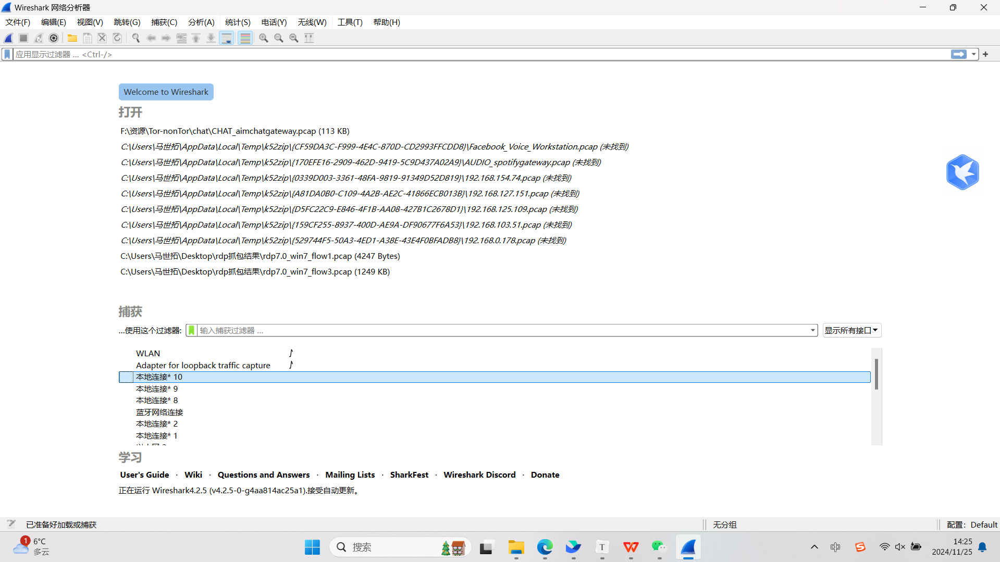
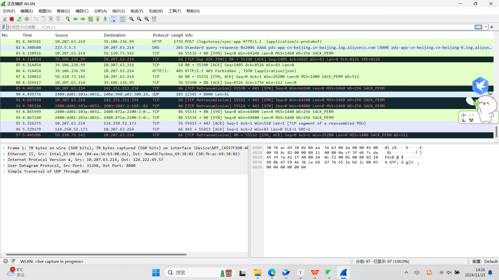
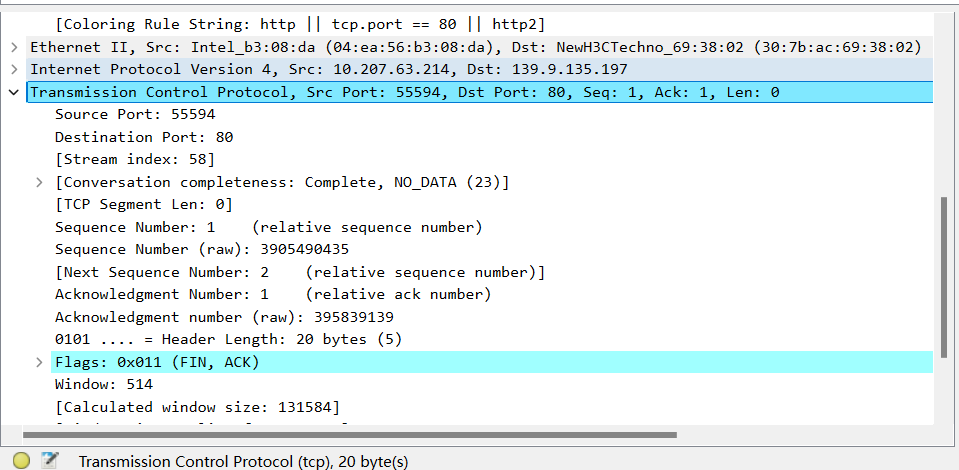
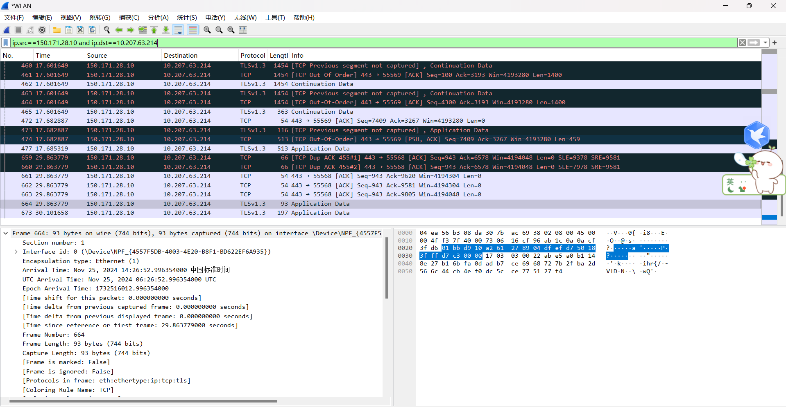
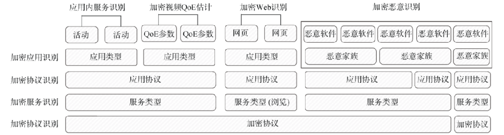

# 什么是网络流量

## 网络流量的基本概念

网络流量（Network Traffic）指的是通过计算机网络传输的数据量。它可以通过在特定的时间段内，网络上的数据包的数量、大小、以及流向等特征来衡量。网络流量通常包含了各种类型的信息，包括数据包，协议信息，源地址与目的地址，端口，传输速率等，简单的文本数据到复杂的多媒体内容都是由这些信息组成，其形式可以是网页请求、文件传输、视频流、VoIP通话等。

网络流量是网络数据的核心载体，通常衡量为在一段时间内通过网络的数据包的数量或大小。具体而言，“流”是指在一段特定的时间间隔之内，通过网络中某一个观测点的所有具有相同五元组（源IP地址、目的IP地址、传输层协议、源端口和目的端口）的分组的集合，它是网络传输的具象表征。

对网络流量的分析能帮助我们做很多事情，比如：

- 服务运营与QoS(Quality of Services)：帮助运营商了解网络流量的分布，带宽的使用情况，方便进行维护和计费等。
- 网络管理：帮助网络管理员了解网络流量的分布，合理规划和升级网络，对应用进行管理。
- 安全管理：帮助安全分析员检测网络攻击与恶意代码以及流量清洗的前提手段。
- 监听取证：保证网络警察能对网络犯罪进行有效执法。
- 学术研究：对网络流量的深度分析也是更好的协议与网络应用设计的基础。

同其他领域数据挖掘任务一样，网络流量领域的数据分析同样遵循“数据采集-预处理-算法建模-应用”四个主要步骤。在后续的章节我们会对分析网络流量时采用的一些机器学习算法进行介绍与归纳。这一讲我们的重点将聚焦于数据的采集和预处理。

## 网络流量数据的采集

采集流量数据需要一些特殊的工具。常见的工具包括wireshark, tcpdump, snort等。我们在本章节中会以wireshark为例为大家展示如何收集网络流量。

常见的流量采集技术路径包括：

- 嗅探技术（Sniffing）
  - 网络嗅探是最基础的网络流量采集方法，通过把网卡或相关设备设置为混杂模式（Promiscuous Mode）来捕获网络中所有传输的数据包，而不仅限于发往该设备的包。
  - 混杂模式：通常情况下，网络接口卡（NIC）只接收发往自身或广播的包。在混杂模式下，NIC会捕获网络上传输的所有数据包。数据包接收后会由网络嗅探器软件解析并存储。
  - 应用场景：本地局域网（LAN）
- 流量采样（Traffic Sampling）
  - 在高流量、高速网络环境下，它允许对数据包或流量进行有控制的采样，从而减少待分析数据量。
  - 采样方法：随机采样，系统采样等
- 网络探针（Network Probe）
  - 网络探针是一种硬件或软件装置，通常部署在网络的关键位置，例如网络流量的入口、出口或关键节点，通过捕获或拦截来往的网络流量进行分析。
  - 优点：通常具备强大的数据包筛选和解析能力，可以实时处理大规模的数据流。
  - 缺点：部署成本过高，需要专业的硬件和配置。
- 端口镜像（Port Mirroring/Switch Port Analyzer, SPAN）
  - 是交换机或路由器提供的一种功能，通过配置可以将一个端口的所有流量复制到另一个特定的端口。通过软件查看捕获的流量。被监听的端口成为源端口，可设置一个或多个源端口，同时支持设置单向或双向流量镜像。此方法仅适用于高速链路。
  - 优点：不会影响网络流量的转发过程，不引入额外的延迟，且能够细粒度地选择特定流量进行监控。
  - 缺点：端口镜像并不具备优先级控制，若镜像的数据量过大，它可能造成目标端口的过载。
- 基于代理的流量捕获
  - 通过在主机或应用层部署代理程序，实现对特定应用流量或协议的捕获，同时队流量进行深度分析。例如HTTP Proxy可以截获全部Web请求和响应。
  - 优点：针对性强，隐蔽，自动化。
  - 缺点：增加了通信路径和延迟，部署和操作复杂。
- 内联监视（Inline Monitoring）
  - 内联监视是一种直接把流量引导经过监控或者安全设备的方法。流量监控设备实际位于数据流路径中，并对流量进行实时分析或过滤。
  - 内联模式：内联IDS/IPS不仅能分析流量，还可以实时阻挡或转发它们。同时实现防火墙功能；负载均衡能将流量均匀分布于多个处理器或设备中进行更有效的分流监控。
  - 优点：能够直接干预和控制捕获的数据包，适合安全防护环境。
  - 缺点：会增加网络的单一点故障风险且可能引入延迟，且对设备的性能和可靠性要求较高。

pcap是目前流量采集比较常见的数据格式。它本质上是一堆二进制流文件，只有通过专门的软件才能解析开。这里我为大家展示wireshark的流量采集与解析。

首先，大家需要在wireshark官网上找到自己操作系统对应的wireshark版本，现在因为大家普遍用windows 10/11或者Ubuntu或者比较高版本的MacOS系统，所以wireshark推荐大家用4.x版本哈。

https://www.wireshark.org/download.html

按照提示，一步步安装就好。安装好了以后打开是这样的：



我们可以点击上面的WLAN运行按钮，它就会采集你当前的网络行为产生的流量。当你停止采集以后，这些数据就会被保存到缓冲区里面，你可以导出为pcap文件，也可以保存成升级版的pcapng文件。



点到单个帧进去，还能看到数据包里面的具体内容以及一些元数据。



还可以按照源端口和目的端口以流为级别进行筛选。



ip.src表示源地址，ip.dst表示目的ip地址。可以看到，这里TCP流发生了乱序。

但目前，现在这些网络流量数据采集的方法会在短时间内积累大量的网络流量数据，给存储、管理带来了不小的挑战。尤其是在计算机网络越来越庞大的时期，异构网络、分布式计算等应用也越来越广泛，流量数据如果想实时监测那就必然会存在非常大的数据量。并且这些流量也包含了用户的网络行为与内容，如果保存不当被不法分子窃密有可能被用来干坏事。所以未来，我们对网络流量的采集重心会放在这些地方：

- 端-边-云多种架构网络与分布式系统的流量采集：端-边-云协同的网络当中，大量的网络流量是通过端侧、边缘侧产生，如果端侧能够自适应地滤掉一些不重要的流量、只把重要的流量采集起来并与云通信，将大大减小负担。
- 内容感知的流量采集：根据网络流量中的内容进行自适应的感知，降低低价值内容的采集权重。
- 高速低延迟的流量采集：真正做到实时流量采集与监测，降低数据拷贝的时间，或者直接从网卡读取和采集。
- 隐私保护的流量采集：防止采集的流量数据被窃密、被越权处理，利用差分隐私与联邦学习等技术保护流量数据的隐私性。
- 加密流量的采集与分析：暗网上的加密流量采集难、分析更难，这一方面的研究是网络流量领域非常热点的问题，包括VPN、Tor等加密流量。在不解密数据的情况下直接分析加密流量并发现威胁。
- 分布式一致性与容错技术：开发适用于流量采集的高容错分布式存储和处理算法，以确保系统在面临硬件或网络故障时，依然能够高效、安全地运转。
- 规避与反规避机制探究：研究现有的规避流量被探测的技术手段（如匿迹效应、流量混淆、时空释痕等），并通过更强的流量分析机制来反规避（例如各种各样的深度学习手段）。


## 网络流量数据的分析

网络流量数据的分析，是通过分析网络流量中的一些统计或内容特征，将不同类型的网络活动进行识别与分类的过程。这个过程本质是一个分类问题，通过流量数据采集、特征提取、机器学习建模等步骤，来确定流量的具体类型。通常我们的目标是分析流量的协议类型或服务类型，例如FTP流量（文件传输）、P2P流量、HTTP流量（网络应用）等。但有时，我们的目标也可以转化为正常或恶意流量的分类，以区分出网络遭受攻击入侵的流量有哪些。另外，还可以针对具体的攻击方法进行进一步的分类。

我们分析网络流量，主要分析的点聚焦于这样几个方面：

- 网络性能管理：通过分析网络流量，可以了解网络的带宽利用率、延迟、丢包率等指标，以便进行网络性能优化和故障排除。
- 安全监控和入侵检测：网络流量分析可以用于监控和检测网络中的异常活动、恶意软件、攻击行为等，帮助及早发现并应对网络安全威胁。这一点我们会在6.2节中探讨。
- 应用程序识别和控制：通过分析网络流量中的协议、端口和负载特征，可以识别出不同的应用程序和服务，并对其进行管理、限制或优先级控制。尤其是在加密流量当中，对加密流量的应用识别更加困难，我们会在6.3节中进行探讨。
- 带宽管理和流量控制：通过网络流量分析，可以了解各个应用程序或用户所占用的带宽情况，并进行合理的带宽分配和流量调整，以优化网络资源利用。在2024年华为杯中国研究生数学建模竞赛当中，B题就考察到了WLAN网络中的负载预测任务。
- 深度包检测技术：通过解析和分析网络数据包的内容和结构来获得更深入的信息。

进行流量识别首先需要确认流量的识别对象, 即如何将连续的加密流量离散化。不同的识别对象直接影响统计特征的分析与生成, 在现有的流量研究工作中, 常见的流量识别对象主要包括包、TCP连接、流、服务、主机。其中, 流是加密流量识别技术中最常用的识别对象。

解析pcap数据包可以通过python的scapy库来实现。例如，我们可以用这样的代码来实现对pcap流量包的分析：

```python
from scapy.all import rdpcap, IP, TCP

# 读取 pcap 文件
packets = rdpcap("your_pcap_file.pcap")

# 遍历 pcap 文件中的每个 packet
for packet in packets:
    # 检查 packet 是否包含 IP 层
    if IP in packet:
        # 获取源 IP 和目的 IP
        src_ip = packet[IP].src
        dst_ip = packet[IP].dst
        print(f"Source IP: {src_ip}, Destination IP: {dst_ip}")
    
    # 检查 packet 是否包含 TCP 层
    if TCP in packet:
        # 获取源端口和目的端口
        src_port = packet[TCP].sport
        dst_port = packet[TCP].dport
        print(f"Source Port: {src_port}, Destination Port: {dst_port}")
        # 获取 TCP 标志位
        flags = packet[TCP].flags
        print(f"TCP Flags: {flags}")
```

除了使用scapy编写程序解析pcap包以外，还有一些软件（如CICFlowMeter）等也可以对pcap包提取各种各样的统计信息。

https://github.com/ahlashkari/CICFlowMeter

这个工具是用Java写的，编译一下生成成功了就可以导入pcap包进行解析了。很多公开的网络流量数据集都是用CICFlowMeter构造的网络流量数据。

## 什么是加密流量

互联网其实可以分为明网、深网、暗网。明网就比如用浏览器可以随便看的内容，例如微博、B站视频这些。而深网技术呢，用浏览器搜不到，但是大家也可以看，比如你的微信朋友圈百度就搜不到。暗网则更深一点，如果不用特制的软件根本看不到，因此信息也比较隐蔽安全。最经典的暗网应用就比如Tor（The Onion Route)——洋葱路由器技术。

暗网，The Dark Web，被设计出来本来是用于军方在战争当中做保密通信用的。结果一些不法分子盯上了暗网流量，发现这个平台上的信息不容易被发现，传输流量也不容易被解析到。由于流量在经过洋葱路由器的时候被层层加密，经过一跳被加密一次、再经过一跳再加密一次、再经过一跳再加密一次，最后明文流量被加密的亲妈都不认识跟洋葱一样一层套一层一层套一层，因此得名洋葱路由器。这样的隐匿机制很适合一些明网上发不出来的东西在暗网上传播，例如黄、赌、毒、诈、黑灰产、窃密的个人/公司机密隐私数据等在暗网上被广泛传播。因此，各个国家都对暗网中滋生的网络公害与犯罪感到头疼，并花了大力气去监测打击。

加密流量特点分为隐蔽性、广泛性、机密性。

- 隐蔽性：未触发防火墙和入侵检测系统的警报和审查机制。
- 广泛性：使用多种加密协议、隧道协议和未知协议隐藏明文信息。
- 机密性：对于中间者，即使获得了密文数据，也难以恢复出明文。

对加密流量的分析，就是在不对流量信息进行解密的情况下，直接分析出暗网流量中存在的应用类型和网络行为。由于SSL/TLS等加密协议使得对内容的解析更加复杂，现在比较流行的加密流量分析方式开始大量采用机器学习与深度学习的方法来进行解析。（这里顺便给我们组打个广告，中国科学院信息工程研究所信息对抗研究室（第五研究室）对抗组长期从事网络测量/流量分析方面的研究，常年招收硕博士，组内气氛非常和谐团结，科研产出多，欢迎各位同学报考~）

加密流量所使用的常见加密协议有如下几种：

- IPSec通过认证头(AH)和封装安全载荷(ESP)这两个安全协议来实现。ESP对分组提供了源可靠性、完整性和保密性的支持。可分为传输模式和隧道模式。由于IPSec能够在IP层加密或认证流量, 可在远程登录、客户/服务器、邮件、文件传输、Web浏览等应用提供加密支持。
- SSL/TLS是建立在TCP/IP层与各种应用层协议之间的安全协议, 用于保证数据传输的安全性、完整性和认证性。SSL协议在应用层协议通信之前就已经完成加密算法和密钥的协商，在此之后所传送的数据都会被加密，从而保证通信的私密性。
- SSH是一种在不安全网络上提供安全远程登录及其他安全网络服务的协议,SSH在通信双方之间建立加密通道，保证传输的数据不被窃听，并使用密钥交换算法保证密钥本身的安全。SSH协议包括传输层协议、用户认证协议和连接协议。传输层协议用于协商和数据处理，提供服务器认证，数据机密性和完整性保护;用户认证协议规定了服务器认证的流程和报文内容;连接协议将加密的安全通道复用成多个逻辑通道，高层应用通过连接协议使用SSH的安全机制。我们用VSCode连接服务器时就有SSH协议的应用。
- VPN作为一种专用网络技术、通常指的是公用数据网络中建立私有虚拟数据网络。它利用隧道协议来实现认证、加密等功能, 对网络数据传输安全性的增强极其有利。VPN软件黑话也被叫做“梯子”。
- Tor在进行正式通信之前, 客户端会向目录服务器请求网络的节点信息, 然后依据某种选路策略选择三个节点作为信息传输过程中的参与节点。当Tor代理发出服务请求后, 会根据目录服务器返回的节点信息选择三个节点作为链路构建的参与节点。Tor网络上节点之间的流量均使用加密保证数据的安全性。



## 参考资料

本教程参考了中国科学院大学网络空间安全学院刘玉岭老师和姜波老师的《网络安全数据分析基础》课程，在此特别鸣谢！这门课让我学到了很多，于是我想把我学到的东西整理出来。
