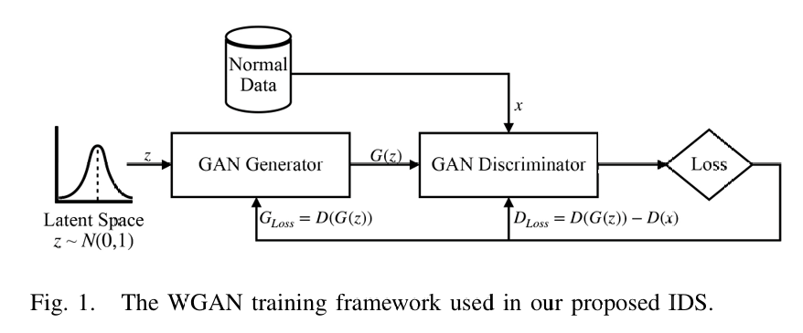

# 网络流量与入侵检测

## 什么是IDS

入侵检测系统（IDS）任务是指通过监测和分析网络流量或系统行为，检测出潜在的恶意活动、异常行为或安全威胁，并及时发出警报或采取措施以保护网络和信息系统安全的过程。IDS的核心目标是识别和响应各种攻击行为，包括但不限于拒绝服务攻击（DoS）、分布式拒绝服务攻击（DDoS）、恶意软件传播、漏洞利用、未授权访问等，从而保障网络的正常运行和数据的安全性。

IDS任务通常涉及以下几个关键环节：

1. **数据收集**：IDS需要从网络流量、系统日志、用户行为等多方面收集数据。这些数据是检测入侵行为的基础，其质量和完整性直接影响IDS的性能。
2. **特征提取与选择**：从收集到的大量数据中提取有意义的特征，并选择对入侵检测最有帮助的特征子集。这一过程旨在减少数据维度，提高检测效率，同时避免引入无关或冗余信息。
3. **异常检测与入侵识别**：IDS通过分析特征数据，识别出与正常行为模式显著偏离的异常行为，或者直接检测已知的攻击模式。异常检测通常依赖于机器学习或统计方法，而入侵识别则可能结合签名匹配和行为分析等技术。
4. **警报与响应**：一旦检测到潜在的入侵行为，IDS会发出警报，通知管理员或自动触发防御机制，如阻断攻击源、隔离受感染的系统等，以减轻攻击的影响。
5. **持续更新与优化**：由于网络环境和攻击手段不断变化，IDS需要持续更新其检测模型和规则，以适应新的威胁和攻击模式，确保其长期有效性。

IDS任务的实施对于现代网络环境至关重要，它不仅能够及时发现和响应安全威胁，还能为网络安全策略的制定和优化提供数据支持，是保障网络和信息系统安全的重要防线。

下面是IDS当中常用的一些特征。

- 连接的基本特征
  - 包含连接双方在通信过程中的基础信息和行为信息
  - 如：连接持续时间、协议类型
- 连接的内容特征
  - 对连接中的负载数据进行分析，提取出可能反映异常行为的特征
  - 如：登录失败的次数、shell命令出现的次数
- 流量的统计特征
  - 在一定时间窗口或指定数量的连接中提取出的可能反映异常行为的特征
  - 如：和当前连接具有相同服务类型的连接数量、指定时间窗口内发往同一个目的IP的数据包的个数
- 原始负载
  - 随着深度学习的发展，报文中的原始负载可以直接作为异常行为检测的数据；深度学习模型能够根据目标函数，通过梯度下降与反向传播技术自动地从原始负载中提取出适用于目标任务的特征


## 网络流量与入侵检测常用数据集

1. **KDD Cup 1999 数据集**

- **描述**：KDD Cup 1999 是入侵检测领域最著名且广泛使用的数据集之一。它包含四种攻击类型（DoS、Probing、R2L、U2R）和正常流量。数据集基于网络流量特征构建，包含41个特征，涵盖持续时间、协议类型、服务类型、标志、源和目的字节等。尽管其规模庞大，但该数据集存在过时和不均衡的问题，无法反映现代网络攻击的复杂性。

2. **NSL-KDD 数据集**

- **描述**：NSL-KDD 是对 KDD Cup 1999 数据集的改进版本，解决了原始数据集中的冗余和不平衡问题。它包含约125,000个样本，分为正常流量和四种攻击类型。数据集包含41个特征，与KDD Cup 1999类似，但通过优化样本选择提高了数据质量和实验效率。

3. **DARPA 数据集**

- **描述**：DARPA 数据集由美国国防部高级研究计划局（DARPA）开发，用于入侵检测系统的评估。它包含多种网络攻击场景，包括DoS、扫描、后门等。数据集基于网络流量和系统日志，包含多个维度，如网络连接、协议类型、数据包大小等。然而，由于其年代较早，无法反映现代网络环境中的攻击类型。

4. **CAIDA 数据集**

- **描述**：CAIDA 数据集由加州大学圣地亚哥分校的网络测量中心提供，包含真实世界的网络流量数据。它主要用于研究DDoS攻击、恶意软件传播等。数据集包含网络流量的详细信息，如数据包大小、协议类型、源/目的IP地址等。其特点是数据量大且具有真实世界的代表性，但缺乏详细的攻击标签。

5. **CICIDS2017 数据集**

- **描述**：CICIDS2017 是加拿大网络安全研究所开发的入侵检测数据集，旨在反映现代网络环境中的真实攻击。它包含多种攻击类型，如DoS、DDoS、Web攻击、Botnet等。数据集包含78个特征，涵盖网络流量的统计信息、持续时间、协议类型等。其特点是数据真实且攻击类型多样，适合用于机器学习模型的训练和评估。

6. **UNSW-NB15 数据集**

- **描述**：UNSW-NB15 数据集由澳大利亚新南威尔士大学开发，包含多种网络攻击类型，如DoS、DDoS、后门、漏洞利用等。数据集包含42个特征，涵盖网络流量的统计信息、协议类型、服务类型等。其特点是攻击类型丰富，数据量大，适合用于入侵检测系统的开发和评估。

7. **Kyoto2006+ 数据集**

- **描述**：Kyoto2006+ 数据集由京都大学开发，包含多种网络攻击类型，如DoS、扫描、恶意软件传播等。数据集包含23个特征，涵盖网络流量的统计信息、协议类型、数据包大小等。其特点是数据真实且具有较好的代表性，适合用于入侵检测系统的评估。

8. **Bot-IoT 数据集**

- **描述**：Bot-IoT 数据集是针对物联网环境中的Botnet攻击开发的数据集。它包含多种攻击类型，如DoS、DDoS、恶意软件传播等。数据集包含115个特征，涵盖网络流量的统计信息、协议类型、设备类型等。其特点是专注于物联网环境，攻击类型多样，适合用于IoT安全研究。

9. **ISCXIDS2012 数据集**

- **描述**：ISCXIDS2012 数据集由加拿大网络安全研究所开发，包含多种网络攻击类型，如DoS、扫描、Web攻击等。数据集包含48个特征，涵盖网络流量的统计信息、协议类型、服务类型等。其特点是数据真实且攻击类型多样，适合用于入侵检测系统的开发和评估。

10. **ADFA-LD 数据集**

- **描述**：ADFA-LD 数据集由澳大利亚国防学院开发，专注于Linux系统中的恶意行为检测。它包含多种攻击类型，如后门、漏洞利用等。数据集包含11个特征，涵盖系统调用、用户行为等信息。其特点是专注于主机级攻击检测，适合用于主机入侵检测系统的开发。


## 基于有监督机器学习的入侵检测

### 特征选择方法

1. 过滤方法（Filter Methods）

过滤方法基于特征本身的统计特性进行选择，不依赖于具体的机器学习模型。它们通常计算特征与目标变量之间的相关性或重要性，然后选择最相关的特征。常见的过滤方法包括：

（1）**基于统计的方法**

- **方差选择法**：通过计算特征的方差，去除方差较小的特征。方差小的特征在数据中变化不大，通常对模型的贡献较小。
- **相关系数法**：计算特征与目标变量之间的相关系数，选择与目标变量相关性较高的特征。例如，皮尔逊相关系数可以衡量特征与标签之间的线性关系。
- **卡方检验（Chi-Square Test）**：用于分类问题，通过计算特征与目标变量之间的卡方统计量，选择与目标变量独立性较小的特征。
- **互信息（Mutual Information）**：衡量特征与目标变量之间的信息共享程度。互信息越高，特征对目标变量的预测能力越强。

（2）**基于信息增益的方法**

- **信息增益（Information Gain）**：用于衡量特征对目标变量的预测能力。信息增益越大，特征对目标变量的区分能力越强。它常用于决策树算法（如ID3）中的特征选择。
- **增益比（Gain Ratio）**：对信息增益进行归一化处理，避免偏向于具有较多取值的特征。增益比是信息增益与特征的内在信息量的比值。

2. 包装方法（Wrapper Methods）

包装方法将特征选择视为一个搜索问题，通过评估特征子集在具体机器学习模型上的性能来选择最优特征。常见的包装方法包括：

（1）**递归特征消除（Recursive Feature Elimination, RFE）**

- 从完整的特征集开始，逐步移除对模型性能贡献最小的特征。RFE通常结合特定的机器学习模型（如SVM、决策树）进行特征评估，通过递归的方式逐步减少特征数量，直到达到预定的特征数量。

（2）**前向选择（Forward Selection）**

- 从空集开始，逐步添加对模型性能提升最大的特征，直到无法进一步提升模型性能为止。这种方法类似于贪心算法，每次选择当前最优的特征。

（3）**后向消除（Backward Elimination）**

- 从完整的特征集开始，逐步移除对模型性能影响最小的特征，直到无法进一步优化模型性能为止。这种方法与RFE类似，但方向相反。

3. 嵌入方法（Embedded Methods）

嵌入方法将特征选择嵌入到模型训练过程中，通过模型自身的学习机制选择特征。常见的嵌入方法包括：

（1）**基于正则化的方法**

- **L1正则化（Lasso）**：通过在损失函数中加入L1正则项，使模型倾向于选择稀疏的特征。Lasso可以自动将不重要的特征权重压缩到0，从而实现特征选择。
- **L2正则化（Ridge）**：通过在损失函数中加入L2正则项，减少特征权重的大小，但不会将特征权重压缩到0。L2正则化通常用于防止过拟合，但也可以辅助特征选择。

（2）**基于树的方法**

- **决策树（Decision Trees）**：通过计算特征的信息增益或基尼不纯度，选择对目标变量区分能力最强的特征。决策树的分裂节点可以直接反映特征的重要性。
- **随机森林（Random Forest）**：通过集成多棵决策树，计算每个特征在所有树中的平均重要性，从而选择对模型贡献最大的特征。
- **梯度提升树（Gradient Boosting Trees）**：通过逐步优化模型，计算每个特征在提升过程中的重要性，选择对模型性能提升最大的特征。

（3）**基于深度学习的方法**

- **自动编码器（Autoencoders）**：通过无监督学习，自动学习数据的低维表示。在编码器的中间层，特征被压缩为低维特征向量，这些向量可以用于特征选择。
- **特征重要性评分（Feature Importance Scores）**：在一些深度学习模型（如XGBoost、LightGBM）中，可以直接输出特征的重要性评分，用于选择关键特征。


### 机器学习模型

机器学习在IDS业务中当然也有着非常广泛的应用。抛开传统的基于规则、签名、模式的那些个方法不谈，我们就拿传统机器学习开刀。机器学习模型因为本身可以分为监督方法和无监督方法，监督方法那就是当成了一个分类问题；而无监督方法，比如聚类，就是针对未知公害能用的一个好方法。主成分分析往往不会单独作为一个IDS模型，往往也是和其他模型组合（例如以前非常多的就是PCA-SVM组合起来做，还有PCA+进化算法，详情可以参考我的《数学建模导论》）。

而监督方法，根据分布模拟还是决策边界，又分为生成方法和判别方法。生成方法主要是一些贝叶斯与概率图模型的方法，如朴素贝叶斯、贝叶斯网络、隐马尔可夫模型等；判别方法则就是我们很常用的一些方法了，比如LR、决策树、支持向量机、集成学习等。


基于机器学习的入侵检测系统（IDS）通常经过以下主要步骤：

1. **数据收集与预处理**：首先从网络流量或系统日志中收集数据，并进行清洗、去噪和特征提取，以生成适合机器学习模型的输入数据。
2. **特征选择与工程**：通过选择关键特征或构造新特征来提高模型的性能和效率，同时减少数据维度以避免过拟合。
3. **模型训练与验证**：利用训练数据集训练机器学习模型，并通过交叉验证等方法调整模型参数，以确保模型的准确性和泛化能力。
4. **模型评估与优化**：使用测试数据集评估模型的性能，如检测率、误报率等，并根据评估结果对模型进行优化。
5. **部署与实时检测**：将训练好的模型部署到实际环境中，实时监测网络流量或系统行为，检测潜在的入侵行为并发出警报。
6. **持续更新与维护**：随着网络环境的变化和新攻击的出现，定期更新数据集和模型，以保持IDS的有效性和适应性。

## 基于无监督方法的入侵检测

### 降维方法

网络流量数据通常具有高维度的特征，例如KDD Cup 99数据集包含41个特征。高维数据不仅增加了计算复杂度，还可能导致模型过拟合，降低检测的准确性和实时性。

PCA通过将高维数据投影到低维空间，同时尽可能保留原始数据的变异信息，从而解决了高维数据带来的问题。具体来说，PCA在IDS中的作用包括：

1. **减少计算复杂度**：通过降维，PCA降低了数据的维度，从而减少了模型训练和推理的时间。
2. **提高模型性能**：PCA可以去除冗余特征，减少噪声，从而提高模型的准确性和泛化能力。
3. **增强数据可视化**：将高维数据降维到2D或3D空间后，可以更直观地分析和可视化数据。
4. **降低过拟合风险**：高维数据容易导致模型过拟合，PCA通过减少特征维度，降低了过拟合的风险。

在应用PCA之前，需要对数据进行预处理，包括数据清洗、标准化和特征提取。例如，使用KDD Cup 99数据集时，可以对数据进行标准化处理，使其均值为0，方差为1。

```python
from sklearn.preprocessing import StandardScaler

# 数据标准化
scaler = StandardScaler()
data_scaled = scaler.fit_transform(data)
```

PCA通过特征值分解将数据投影到新的坐标轴上。以下是PCA降维的步骤：

1. **数据中心化**：将数据减去均值，使其均值为0。
2. **计算协方差矩阵**：协方差矩阵用于描述特征之间的相关性。
3. **求解特征值和特征向量**：特征值表示方差的大小，特征向量表示方向。
4. **选择主成分**：根据特征值的大小选择前k个特征向量，形成新的特征空间。
5. **转换数据**：将原始数据投影到新的特征空间中。

```python
from sklearn.decomposition import PCA

# 应用PCA降维
pca = PCA(n_components=10)  # 选择降维后的维度
data_pca = pca.fit_transform(data_scaled)
```

### 聚类方法

网络入侵检测系统（IDS）是保障网络安全的重要工具之一。它通过监控网络流量，识别潜在的安全威胁和异常行为。聚类算法作为一种无监督学习方法，在IDS中有着广泛的应用，特别是在处理未知攻击和异常检测方面。

在IDS中，处理流量数据的第一步是数据预处理。这包括数据清洗、特征提取和标准化等步骤。常用的数据集如KDD CUP数据集，包含了多种网络连接数据，通过对这些数据进行预处理，可以为后续的聚类分析打下基础。

```python
import pandas as pd
from sklearn.preprocessing import StandardScaler

# 读取数据
data = pd.read_csv('data/kddcup.data_10_percent', sep=',', header=None)

# 数据预处理
data.columns = ['duration', 'protocol_type', 'service', 'flag', 'src_bytes', 'dst_bytes', 'land', 'wrong_fragment', 'urgent', 'hot', 'num_failed_logins', 'logged_in', 'num_compromised', 'root_shell', 'su_attempted', 'num_root', 'num_file_creations', 'num_shells', 'num_access_files', 'num_outbound_cmds', 'is_host_login', 'is_guest_login', 'count', 'srv_count', 'serror_rate', 'srv_serror_rate', 'rerror_rate', 'srv_rerror_rate', 'same_srv_rate', 'diff_srv_rate', 'srv_diff_host_rate', 'dst_host_count', 'dst_host_srv_count', 'dst_host_same_srv_rate', 'dst_host_diff_srv_rate', 'dst_host_same_src_port_rate', 'dst_host_srv_diff_host_rate', 'dst_host_serror_rate', 'dst_host_srv_serror_rate', 'dst_host_rerror_rate', 'dst_host_srv_rerror_rate', 'label']

# 特征提取和标准化
features = data.drop('label', axis=1)
scaler = StandardScaler()
features_scaled = scaler.fit_transform(features)
```

在IDS中，聚类的主要目标是将网络流量数据分为正常流量和异常流量。通过聚类，可以识别出与正常行为模式不同的异常行为，从而实现对未知攻击的检测。

K-Means是一种经典的聚类算法，其主要思想是将数据点分为K个簇，每个簇由一个中心点（质心）代表。算法通过迭代优化，使得每个数据点到其所属簇的质心的距离之和最小。

Python复制

```python
from sklearn.cluster import KMeans

# 训练K-Means模型
kmeans = KMeans(n_clusters=3, random_state=0).fit(features_scaled)

# 获取聚类结果
labels = kmeans.labels_
```

DBSCAN是一种基于密度的聚类算法，通过检查数据点的ε邻域来确定核心点、边界点和噪声点。核心点是指在其ε邻域内包含足够多数据点的点，边界点是指在核心点的ε邻域内但不满足核心点条件的点，噪声点是指既不是核心点也不是边界点的点。

```python
from sklearn.cluster import DBSCAN

# 训练DBSCAN模型
dbscan = DBSCAN(eps=0.5, min_samples=5).fit(features_scaled)

# 获取聚类结果
labels = dbscan.labels_
```

基于异常的入侵检测方法通过识别与正常行为模式不同的异常行为来检测潜在的安全威胁。聚类算法在这方面有着重要的应用。例如，DBSCAN算法可以通过识别噪声点来检测异常流量。

```python
# 识别异常点
anomalies = features_scaled[labels == -1]
```

## 基于深度学习的入侵检测方法

### CNN-Based Model

和上一节的方法很类似，在做IDS任务的时候，卷积神经网络也是非常常用的一种方法。使用CNN进行网络入侵流量检测的基本思想是将网络流量数据转化为图像或序列形式，利用CNN强大的特征提取能力来自动学习流量数据中的关键特征，从而实现对正常流量和入侵流量的分类。其基本流程包括：数据预处理，如将流量数据转化为适合CNN输入的格式；构建CNN模型，通常包含多个卷积层和池化层，卷积层通过卷积核对输入数据进行卷积操作，提取局部特征；池化层则对卷积层的输出进行下采样，降低特征维度；最后通过全连接层输出分类结果。CNN的局部感知能力和参数共享特性使其能够高效地从大量网络流量数据中提取出有用的特征，同时减少模型参数数量，提高模型的泛化能力和训练效率，从而有效实现网络入侵流量检测。

**Azizjon M, Jumabek A, Kim W. 1D CNN based network intrusion detection with normalization on imbalanced data[C]//2020 international conference on artificial intelligence in information and communication (ICAIIC). IEEE, 2020: 218-224.** 

这篇文章提出了一种基于1D卷积神经网络（1D-CNN）的网络入侵检测系统，以解决传统IDS方法在应对未知和不可预测攻击时的灵活性和效率问题。传统的IDS方法依赖于签名检测和异常检测，但难以有效识别未知威胁。1D-CNN被选用于时间序列数据的监督学习，因为它能够从网络流量中提取高层次的特征表示。作者将TCP/IP数据包序列化并标记为正常和异常流量，用于训练1D-CNN模型。为了处理不平衡数据，作者使用了随机过采样技术来解决不平衡数据问题。具体来说，作者在训练集中对少数类（攻击记录）进行过采样，使其数量与多数类（正常记录）相当。这种方法有助于提高模型在少数类上的性能。在实验中，作者将原始数据集划分为训练集和测试集，并使用随机过采样技术生成平衡的训练数据集，然后再进行模型的训练和评估。实验在UNSW_NB15数据集上进行，结果表明1D-CNN模型在准确率、精确率和召回率上优于传统的机器学习分类器如SVM和RF。然而，该方法的局限性在于需要大量的计算资源进行训练，并且对数据预处理的要求较高。


**Nazre R, Budke R, Oak O, et al. A Temporal Convolutional Network-based Approach for Network Intrusion Detection[J]. arXiv preprint arXiv:2412.17452, 2024.** 

那么，这一篇相比上一篇，就又有了一些改进。这篇更多的就开始使用时序卷积来捕获流量中的时序关系了。这比单纯的特征组合与交叉恐怕还要好一些，因为时空特性说白了反映的就是流量对应的行为，尽管说对时序关系的建模用LSTM更常见，但通过纯卷积来捕获时空信息的方法也绝非没有。比如在这篇当中，所提出的模型采用 TCN 来克服 CNN-LSTM 等混合模型的局限性。TCN 利用因果卷积来确保预测仅依赖于过去的数据，从而保持时间顺序并实现高效的并行处理。扩张的凸面在不增加网络深度的情况下扩大了感受野，使 TCN 能够有效地捕获短期和长期依赖性。TCN 架构具有残差连接，可改善梯度流并缓解消失的梯度问题，稳定训练并增强表示学习。


**Zhang Y, Chen X, Guo D, et al. PCCN: parallel cross convolutional neural network for abnormal network traffic flows detection in multi-class imbalanced network traffic flows[J]. IEEE Access, 2019, 7: 119904-119916.**

看完上一节，大家是不是在想：那有没有可能，我在IDS任务里面也把pcap转成图像，用视觉方法分析呢？当然是有的。毕竟IDS和加密流量分类都是分类任务，方法上二者其实是可以互通的。因为网络流量和图像一样，都是高维数据。在图像中，像素与其邻近的像素具有高度的相关性。同样，在网络流量数据中，一个时间窗口内的数据包也可能具有相似的特性或模式；在图像识别中，对象可以出现在不同的尺度和角度，而网络流量异常检测也需要从不同的时间窗口或协议层次来考察数据。这篇文章主要有几个点可以讲讲：

1. 关于怎么从流里面提取特征，文章当中提出了这么一个算法；

   

2. 关于怎么把流转换成图，文章里面的思想是这么回事： 首先，从pcap文件中提取网络流量的特征，如流量大小、协议类型、时间戳等。然后，这些特征被映射到颜色空间，形成彩色图像的像素值。通过这种方式，原始的网络流量数据被转换成二维图像，使得可以使用卷积神经网络（CNN）进行特征学习和异常检测。 

   

3. 关于文章当中模型的架构，我想补充一点：虽然它在论文中明确说明是从FCN获得了灵感，这里它构造了并行的支线，其实也有参考Inception的设计思想，但是在后面又进行了交叉融合，就又有点想shuffleNet。本质上是为了推动并行化，但它把不同尺度的特征分离出来了，又做了一个融合，形成新的交叉特征，是提高表示学习的一个好想法。但在解释说理方面，未必能很好地讲完满这个故事，或许可以结合一些可解释性的理论比如流谱理论等。


### RNN/LSTM-Based Model

循环神经网络（RNN）是一种处理序列数据的神经网络，其核心在于具有循环连接的神经元结构，能够将前一时刻的输出作为当前时刻的输入，从而捕捉序列数据中的时间依赖关系。然而，标准的RNN在处理长序列时容易出现梯度消失或梯度爆炸的问题，导致难以学习到长距离的依赖关系。

长短期记忆网络（LSTM）是RNN的一种改进版本，它通过引入输入门、遗忘门和输出门三个门控机制来解决梯度问题。输入门控制新信息的写入，遗忘门决定哪些信息需要遗忘，输出门则控制信息的输出。这种门控机制使得LSTM能够有效地学习到序列中的长短期依赖关系，更好地处理长序列数据。

在IDS（网络入侵检测）任务中，网络流量数据具有明显的序列特性，例如一个会话中的多个数据包按照时间顺序传输。LSTM可以将网络流量数据视为序列输入，通过学习数据包之间的时序关系，识别出正常流量和异常流量的模式差异。例如，它可以捕捉到正常会话中数据包的传输规律，如特定的协议使用顺序、数据包大小的变化趋势等，当遇到与这些规律不符的流量序列时，就可能判断为潜在的入侵行为。其核心思想是利用LSTM强大的序列建模能力，挖掘网络流量的时序特征，从而实现对网络入侵的准确检测。

**Roy B, Cheung H. A deep learning approach for intrusion detection in internet of things using bi-directional long short-term memory recurrent neural network[C]//2018 28th international telecommunication networks and applications conference (ITNAC). IEEE, 2018: 1-6.** 

这篇论文的主要工作是提出了一种基于双向长短期记忆循环神经网络（BLSTM RNN）的深度学习方法，用于物联网（IoT）中的入侵检测。主要思想是利用BLSTM RNN强大的序列建模能力，能够同时考虑序列数据的正向和反向信息，从而更全面地捕捉网络流量数据中的时序特征。通过在UNSWNB15数据集上训练多层深度学习神经网络，该模型能够对IoT网络中的正常和攻击模式进行二元分类。实验结果表明，该模型在攻击检测的准确性、召回率、F1分数和误报率等方面表现出色，准确率超过95%，为构建高精度的入侵检测模型提供了一种新的研究方法。但是这篇做的很简单，入门复现的话大家可以考虑试试。

**Wang W, Sheng Y, Wang J, et al. HAST-IDS: Learning hierarchical spatial-temporal features using deep neural networks to improve intrusion detection[J]. IEEE access, 2017, 6: 1792-1806.** 

很常见的一个想法是，把CNN和LSTM组合起来做IDS任务。你想，一个学时间特征，一个学空间特征，组合起来，那可不就是时空特征都有了吗？这篇来自中科大团队的文章就结合了二者，本文提出了一种基于深度神经网络的分层时空特征入侵检测系统（HAST-IDS），旨在通过自动学习网络流量的空间和时间特征来提高入侵检测系统的性能。该系统首先使用卷积神经网络（CNN）从网络流量中学习低层次的空间特征，然后使用长短期记忆网络（LSTM）从多个网络包的时间序列中学习高层次的时间特征。这种分层结构的设计动机在于利用深度神经网络的强大表示学习能力，以自动提取更准确和更具代表性的网络流量特征，从而有效降低误报率并提高检测率。实验结果表明，HAST-IDS在准确性和检测率方面优于其他方法，并成功展示了其在特征学习和误报率减少方面的有效性。未来的研究将关注于处理不平衡数据集的问题，并探索将传统特征与深度学习模型结合的可能性。


- 怎么学空间特征：

  

- 怎么学时间特征：

  


### 早期生成式模型

在GAN诞生之前，其实就有了不少深度学习生成模型。典型的就比如AE（自编码器）、RBM（限制玻尔兹曼机）、DBN（深度信念网络）。巧合的是，这仨在IDS里面都有用。

自编码器架构的作用原理是通过编码器将高维输入数据压缩成低维的隐变量，再通过解码器将隐变量还原到初始维度，期望解码器的输出能够尽可能地恢复出原来的输入。其优化目标是最小化输入数据和重构输出之间的差异，通常使用均方误差（MSE）作为损失函数。在IDS（网络入侵检测系统）中的应用基本思想是利用自编码器学习正常流量的特征表示，当输入数据与正常流量的特征表示差异较大时，判断为异常流量。基本流程包括：输入网络流量数据，通过编码器提取特征，解码器尝试重构数据，计算重构误差，若误差超过设定阈值则标记为异常。输入特征通常是网络流量的各种属性，如包大小、传输协议等，输出效果是判断流量是否为异常，能够有效提高少数类（攻击流量）的检测准确率并降低误报率。

**D’Angelo G, Palmieri F. Network traffic classification using deep convolutional recurrent autoencoder neural networks for spatial–temporal features extraction[J]. Journal of Network and Computer Applications, 2021, 173: 102890.** 


受限玻尔兹曼机（RBM）是一种基于能量的概率生成模型，由可见层（输入层）和隐藏层组成，层间全连接而层内无连接。其作用原理是通过学习输入数据的概率分布，捕捉数据中的潜在结构。在训练过程中，RBM通过正向传播（从可见层到隐藏层）和反向传播（从隐藏层到可见层）来更新权重和偏置，使得生成的数据尽可能接近原始数据。

在IDS（入侵检测系统）中，RBM的基本思想是利用其强大的特征学习能力，对高维网络流量数据进行无监督学习，去除冗余特征，减小噪声数据的影响，保留有用信息，降低数据复杂度。基本流程包括：首先，将网络流量数据输入RBM的可见层；然后，通过权重和偏置的调整，RBM在隐藏层生成数据的特征表示；最后，将这些特征用于后续的分类器（如SVM或BP神经网络）进行入侵检测。

输入特征通常是网络流量数据的各种属性，如数据包大小、传输协议、源/目的IP地址等。RBM的输出效果是将这些高维输入特征转换为低维的特征表示，这些特征表示能够更有效地揭示数据中的潜在规律，从而提高入侵检测的准确性和效率。通过这种方式，RBM能够帮助IDS更好地识别正常流量和攻击流量，减少误报和漏报。

**Aldwairi T, Perera D, Novotny M A. An evaluation of the performance of Restricted Boltzmann Machines as a model for anomaly network intrusion detection[J]. Computer Networks, 2018, 144: 111-119.** 

DBN本质上是RBM的一种堆叠与扩展。深度信念网络（DBN）是一种由多个受限玻尔兹曼机（RBM）堆叠而成的生成图模型，其作用原理是通过逐层贪婪预训练的方式，逐层训练每一层RBM，并将每一层RBM的输出作为下一层RBM的输入。在预训练阶段，DBN使用无监督学习方法逐层训练RBM，从底层到顶层依次构建网络结构，确保特征向量映射到不同特征空间，都尽可能地保留特征信息。在微调阶段，使用有监督学习方法对整个DBN进行参数调整，提高分类精度。

在入侵检测系统（IDS）中，DBN的基本应用思想是利用其强大的特征提取能力，将高维的网络流量数据转化为低维的特征表示，从而提高入侵检测的准确性。基本流程包括：首先，对网络流量数据进行预处理，提取原始特征；然后，使用DBN的预训练阶段逐层提取特征；接着，在微调阶段使用有标签的数据对整个网络进行优化；最后，使用训练好的DBN模型对新的网络流量数据进行分类，判断其是否为入侵行为。

**Wei P, Li Y, Zhang Z, et al. An optimization method for intrusion detection classification model based on deep belief network[J]. Ieee Access, 2019, 7: 87593-87605.** 

这篇文章就是结合了DBN和进化计算方法的一个工作。它把IDS用运筹优化的视角解读。这篇文章的主要工作是提出了一种新的联合优化算法，用于优化基于深度信念网络（DBN）的入侵检测分类模型（DBN-IDS）。首先，设计了一种基于自适应惯性权重和学习因子的粒子群优化（PSO）算法。接着，利用鱼群行为（如聚群、觅食等）优化PSO，以找到初始优化解。然后，基于初始优化解，使用具有自调整交叉概率和变异概率的遗传算子进一步优化PSO，以搜索全局优化解。最后，将通过上述联合优化算法构建的全局优化解作为入侵检测分类模型的网络结构。实验结果表明，与其它DBN-IDS优化算法相比，该算法在增加平均训练时间6.9%的前提下，将平均检测时间缩短了至少24.69%；与测试的分类算法相比，其DBN-IDS在五分类任务中平均分类准确率至少提高了1.3%，最高可达14.80%，证明了该方法是一种高效的DBN-IDS优化方法。

### GAN-Based Model

生成对抗网络（GAN）是一种用于生成数据的深度学习模型，由两个主要部分组成：生成器和判别器。

- 生成器（Generator）：负责生成新数据，其目标是生成足以以假乱真的数据。接收随机噪声作为输入，输出生成的样本。
- 判别器（Discriminator）：用于区分真实数据和生成数据。接收真实数据和生成数据，输出其来源的概率。


GAN在入侵检测系统（IDS）中的应用主要基于其生成器和判别器的协同工作，通过对抗训练学习数据的内在结构和模式，从而生成具有相似特征的新数据。其基本思想是利用生成器学习正常数据的分布特征，生成与真实数据类似的样本，然后通过判别器判断输入数据是否为真实数据，以此来检测异常样本。

在IDS中，GAN的应用流程通常包括以下几个步骤：

1. **数据预处理**：对从网络中获取的数据进行标准化处理，如使用变分高斯混合模型进行标准化。
2. **模型训练**：使用GAN的生成器生成正常数据样本，同时训练判别器以区分真实数据和生成数据。通过交替训练生成器和判别器，直到达到预设的训练目标。
3. **异常检测**：在测试阶段，将测试样本与生成器生成的样本进行比较，如果差异较大，则认为是异常样本。
4. **模型优化**：根据检测结果调整模型参数，优化生成器和判别器的性能，以提高检测的准确性和鲁棒性。

GAN在IDS中的原理是通过生成器和判别器的对抗训练，使生成器能够生成与真实数据难以区分的样本，而判别器则不断学习如何更准确地识别这些样本。这种对抗机制使得模型能够更好地捕捉数据的分布特征，从而在检测异常时更加敏感和准确。此外，GAN还可以用于生成对抗样本，对现有的IDS进行攻击测试，以评估和提高其安全性。

**Seo E, Song H M, Kim H K. GIDS: GAN based intrusion detection system for in-vehicle network[C]//2018 16th annual conference on privacy, security and trust (PST). IEEE, 2018: 1-6.** 

与传统的 Internet IDS 不同，车辆网络的已知攻击特征数量较少。此外，车辆的 IDS 需要高精度，因为任何误报错误都会严重影响驾驶员的安全。为了解决这个问题，我们提出了一种用于车载网络的新型 IDS 模型，即使用深度学习模型 Generative Adversarial Nets 的 GIDS（基于 GAN 的入侵检测系统）。GIDS 可以学习仅使用普通数据来检测未知攻击。作为实验结果，GIDS 对 4 种未知攻击的检测准确率很高。


**Lee J H, Park K H. GAN-based imbalanced data intrusion detection system[J]. Personal and Ubiquitous Computing, 2021, 25(1): 121-128.** 

尽管深度学习在学习大量数据时的性能比机器学习算法更准确，但在从不平衡的数据中学习时，性能会显著下降。而且，虽然有许多关于不平衡数据的研究，但大多数研究都存在可能导致数据丢失或过度拟合的弱点。这篇文章的主要工作是提出了一种基于生成对抗网络（GAN）的不平衡数据入侵检测系统。研究动机是解决现有入侵检测系统在处理不平衡数据时性能不佳的问题，即正常流量数据远多于攻击流量数据，导致检测模型对少数类攻击的识别能力不足。为了解决这一问题，文章构造了一个GAN模型，核心思想是利用GAN的生成器生成少数类攻击样本，以平衡数据集，然后训练一个更健壮的分类器来区分正常流量和攻击流量。这种方法有用是因为GAN能够学习数据的分布并生成新的样本，从而增加少数类样本的数量，提高模型对不平衡数据的处理能力和检测精度。


**de Araujo-Filho P F, Naili M, Kaddoum G, et al. Unsupervised gan-based intrusion detection system using temporal convolutional networks and self-attention[J]. IEEE Transactions on Network and Service Management, 2023, 20(4): 4951-4963.** 

 第五代 （5G） 网络提供与大量设备的连接，并促进了多个不同领域的大量应用。然而，互联设备的大量采用增加了攻击面，并引入了多种安全威胁。一些基于LSTM的IDS 利用时序建模的方法来考虑数据之间的时间依赖性。然而，LSTM 网络最近被证明存在一些缺点和局限性，这使得它们在序列建模任务中的性能受到质疑。因此，在本文中，我们研究了生成对抗网络 （GAN），这是一种通过隐式建模系统来检测攻击的有前途的无监督方法，以及 LSTM 网络的替代方案，以考虑数据之间的时间依赖关系。我们提出了一种新颖的基于 GAN 的无监督 IDS，它使用时间卷积网络 （TCN） 和自我注意来检测网络攻击。拟议的 IDS 利用边缘计算，并提议用于边缘服务器，使计算资源更接近终端节点。实验结果表明，我们提出的 IDS 可以配置为满足不同的检测率和检测时间要求。此外，它们表明我们的 IDS 更准确，比两个用作基线的最先进的基于 GAN 的 IDS 更快至少 3.8 倍。 



**Lin Z, Shi Y, Xue Z. IDSGAN: Generative adversarial networks for attack generation against intrusion detection[C]//Pacific-asia conference on knowledge discovery and data mining. Cham: Springer International Publishing, 2022: 79-91.** 

如今，在机器学习算法的帮助下，入侵检测系统得到了快速发展。然而，当面对对抗性攻击时，该系统的鲁棒性值得商榷。为了增强检测系统的鲁棒性，更多的潜在攻击方法正在被研究。在本文中，提出了一种生成对抗网络框架，称为IDSGAN，旨在生成对抗性的恶意流量记录，通过欺骗和规避检测来攻击入侵检测系统。鉴于攻击者对检测系统的内部结构和参数一无所知，对抗性攻击样本对检测系统实施的是黑盒攻击。IDSGAN利用一个生成器将原始恶意流量记录转换为对抗性的恶意流量记录。一个判别器对流量样本进行分类，并动态学习实时的黑盒检测系统。更重要的是，为了保留对抗性流量记录的原始攻击功能，设计了一种限制性修改机制用于对抗性生成。通过使用不同攻击类别的多种算法基础的检测模型进行攻击，证明了该模型的有效性。通过改变修改特征的数量来验证鲁棒性。与对抗性攻击基线的比较实验展示了我们模型的优越性。

  


## 图神经网络在入侵检测中的应用

**Bilot T, El Madhoun N, Al Agha K, et al. Graph neural networks for intrusion detection: A survey[J]. IEEE Access, 2023, 11: 49114-49139. **

图的种类有很多，除了一般我们所熟知的有向图无向图外，还有很多种不同的图结构可以被应用到IDS任务当中。下面我们介绍一些典型的图结构：

- 图：图简单地表示为 G=(V,E)，其中 V 是节点（或实体）的集合，E 是这些节点之间的边（或关系）的集合。

- 异质图：异质图包含多种类型的节点和边。形式上，它可以定义为 G=(V,E,ϕv,ϕe)，其中 ϕv 和 ϕe 是函数，分别将每个节点和每条边映射到一个类型。

- 属性图：属性图将属性附加到图的元素（即节点和/或边）。节点属性图描述为 G=(V,E,Xv)，其中 Xv 是一个映射函数，将每个节点 v∈V 映射到属性列表。同样，边属性图描述为 G=(V,E,Xe)，其中 Xe 将每条边 e∈E 映射到属性列表。

- 时空图：时空图是一个具有静态结构和时变特征的图。形式上，它可以描述为 Gt=(V,E,Xv,t,Xe,t)， 其中 Xv,t 和 Xe,t 是函数，分别将每个节点 v∈V 和每条边 e∈E 映射到一个特征向量，该特征向量表示每个元素在时间戳 t 时的属性。

- 动态图：动态图模型了图中时变的结构以及时变的特征。实际上，动态图将每条边和/或节点与一个时间戳相关联，表示事件（例如添加、移除或更新节点/边）的时间。大多数论文使用离散时间动态图（DTDGs），其中演变的图通过一系列 S 个图快照 G1,…,GS 来建模，其中 Gt 是在时间戳 t 捕获的图的快照。形式上，它可以描述为 Gt=(Vt,Et,Xv,t,Xe,t)，其中 Vt 和 Et 表示每个时间戳 t 时的图结构，而 Xv,t 和 Xe,t 表示时变特征。其他方法利用连续时间动态图（CTDGs），它们为图中观察到的每个事件关联一个单独的时间戳，从而为每个事件创建一个新的快照。与 DTDGs 相比，CTDGs 提供了更细粒度的事件表示，但在文献中仍然很少使用。


图结构天然适合做网侧或者端网融合模型。使用图神经网络进行IDS主要分为三步：数据预处理，图嵌入表示和模型训练。在数据预处理方面，可以将流量信息或者日志信息组织为图结构。而在处理过程中，节点或边能为下游提供更丰富的语义信息。第二步，图嵌入，使用GNN能经过表示学习的方式方法为节点或边提供嵌入。第三步就是最末位的了，分类模型的训练。根据网络流量的使用层面，也可以分为流级图和包级图。


65 71 72 55 50 75 79

**J. Zhou, Z. Xu, A. M. Rush, and M. Yu, ‘‘Automating botnet detection with graph neural networks,’’ 2020, arXiv:2003.06344.** 

 僵尸网络现在是许多网络攻击（如 DDoS 攻击和垃圾邮件）的主要来源。然而，大多数传统检测方法严重依赖于启发式设计的多阶段检测标准。在本文中，我们考虑了使用现代深度学习技术自动学习僵尸网络检测策略的神经网络设计挑战。为了生成训练数据，我们将具有不同底层通信模式的僵尸网络连接合成为数据集。为了捕获中心化僵尸网络的重要层次结构和去中心化僵尸网络的快速混合结构，我们定制了图神经网络 （GNN） 来检测这些结构的特性。实验结果表明，当使用适当的数据进行训练时，GNN 比以前的非学习方法更能捕获僵尸网络结构，并且更深的 GNN 对于学习困难的僵尸网络拓扑至关重要。我们相信我们的数据和研究对网络安全和图学习社区都有用。 

**W. W. Lo, S. Layeghy, M. Sarhan, M. Gallagher, and M. Portmann, ‘‘E-GraphSAGE: A graph neural network based intrusion detection sys tem for IoT,’’ in Proc. NOMS IEEE/IFIP Netw. Oper. Manage. Symp., Apr. 2022, pp. 1–9.**

该文提出了一种基于图神经网络 （GNN） 的新型网络入侵检测系统 （NIDS）。GNN 是深度神经网络的一个相对较新的子领域，它可以利用基于图的数据的固有结构。NIDS 的训练和评估数据通常表示为流记录，自然可以以图形格式表示。在本文中，我们提出了 E-GraphSAGE，这是一种 GNN 方法，允许捕获图的边缘特征以及拓扑信息，以便在 IoT 网络中进行网络入侵检测。据我们所知，我们的提案是使用基于流的数据将 GNN 应用于 IoT 网络入侵检测问题的第一个成功、实用且经过广泛评估的方法。我们对四个最近的 NIDS 基准数据集进行了广泛的实验评估，结果表明，我们的方法在关键分类指标方面优于最先进的方法，这证明了 GNN 在网络入侵检测中的潜力，并为进一步研究提供了动力。

**Y. Yang and L.Wang,‘‘LGANet:Local graph attention network for peer to-peer botnet detection,’’ in Proc. 3rd Int. Conf. Adv. Comput. Technol., Inf. Sci. Commun. (CTISC), Apr. 2021, pp. 31–36.** 

 僵尸网络已成为针对网络安全的重大入侵威胁之一。点对点 （P2P） 僵尸网络的去中心化特性使其易于生存且难以被发现。在本文中，我们提出了本地图注意力网络 （LGANet），这是一种新颖的框架，可以利用基于网络流量的特征和拓扑特征来精确检测 P2P 机器人。首先，我们将网络通信图中的每个节点视为一个质心，并构建一个局部图来生成上下文感知特征。其次，将局部图注意力机制应用于局部图，旨在关注大多数拓扑相关信息;此外，为了充分捕获不同表示子空间中的各种特征，构建了一个多头局部图注意力层，该文并行包含多个单头局部图注意力层。第三，我们设计了一个自适应门融合模块，自适应地融合不同级别的特征，产生丰富的演示。广泛的实验结果表明，我们的 LGANet 在 P2P 僵尸网络检测方面的有效性。 


**L. Chang and P. Branco, ‘‘Graph-based solutions with residuals for intru sion detection: The modifiedE-GraphSAGEandE-ResGATalgorithms,’’ 2021, arXiv:2111.13597.** 

 大量日益复杂的网络威胁引起了人们对网络安全的日益关注，其中许多挑战仍未解决。也就是说，对于入侵检测，需要更健壮、更有效且能够使用更多信息的新算法。此外，入侵检测任务还面临着与正常流量和恶意流量之间的极端类别不平衡相关的严峻挑战。最近，图神经网络 （GNN） 实现了最先进的性能，可以对网络安全任务中的网络拓扑进行建模。然而，只有少数工作使用 GNN 来解决入侵检测问题。此外，其他有前途的途径，如应用注意力机制，仍未得到充分探索。本文提出了两种新颖的基于图的入侵检测解决方案，即改进的 E-GraphSAGE 和 E-ResGAT算法，它们分别依赖于已建立的 GraphSAGE 和图注意力网络 （GAT）。关键思想是利用可用的图信息将残差学习集成到 GNN 中。加入残差连接作为处理高级类不平衡的策略，旨在保留原始信息并提高少数类的性能。对四个最近的入侵检测数据集的广泛实验评估表明，我们的方法具有出色的性能，尤其是在预测少数群体时。 

2. E-ResGAT算法：
  - 注意力机制：引入图注意力网络（GAT）的注意力机制，使模型能够关注于流量中最相关的邻居，而不是平等对待所有邻居。
  - 残差连接：在E-ResGAT中也使用了残差连接，通过在每一层中添加原始节点特征的转换，使模型能够更深入地学习并逐步优化节点嵌入。
  - 边特征支持：E-ResGAT支持边特征，并在边分类任务中利用这些特征。
  - 图结构的构建：二部图和线图：将网络流数据编码为边分类任务，通过构建二部图和线图结构，将问题转换为节点分类任务，以适应GAT模型。


**E. Caville, W. W. Lo, S. Layeghy, and M. Portmann, ‘‘Anomal-E: A self-supervised network intrusion detection system based on graph neural networks,’’ Knowl.-Based Syst., vol. 258, Dec. 2022, Art. no. 110030.** 

本文研究了图神经网络 （GNN） 在自监督网络入侵和异常检测中的应用。GNN 是一种基于图的数据深度学习方法，它将图结构整合到学习中，以泛化图表示和输出嵌入。由于网络流本质上是基于图的，因此 GNN 适合分析和学习网络行为。当前大多数基于 GNN 的网络入侵检测系统 （NIDS） 的实施严重依赖标记网络流量，这不仅会限制输入流量的数量和结构，还会限制 NIDS 适应看不见的攻击的潜力。为了克服这些限制，我们提出了 Anomal-E，这是一种用于入侵和异常检测的 GNN 方法，它在自我监督过程中利用边缘特征和图形拓扑结构。据我们所知，这种方法是第一个成功且实用的网络入侵检测方法，该方法利用网络流量，利用 GNN 的自我监督边缘。两个现代基准 NIDS 数据集的实验结果不仅清楚地显示了使用 Anomal-E 嵌入而不是原始特征的改进，而且还显示了 Anomal-E 在野外网络流量检测方面的潜力。


**Y. Cao, H. Jiang, Y. Deng, J. Wu, P. Zhou, and W. Luo, ‘‘Detecting and mitigating DDoS attacks in SDN using spatial–temporal graph convolu tional network,’’ IEEE Trans. Depend. Secure Comput., vol. 19, no. 6, pp. 3855–3872, Nov. 2022.** 

 随着数据平面可编程软件定义网络 （SDN） 的发展，数据平面上的分布式拒绝服务 （DDoS） 攻击变得越来越致命。目前，传统的攻击检测方法主要用于检测是否发生 DDoS 攻击，很难找到攻击流穿过网络的路径，难以准确缓解 DDoS 攻击。在本文中，我们提出了一种基于时空图卷积网络 （ST-GCN） 的数据平面可编程 SDN 的检测方法，将网络映射到图中。它通过带内网络遥测 （INT） 和采样感知交换机的状态，将网络状态输入到时空图卷积网络检测模型中，最终找出 DDoS 攻击流通过的交换机。基于此，我们提出了一种结合增强白名单和精准丢弃策略的防御方法，可以有效缓解 DDoS 攻击，最大限度地减少对合法网络流量的影响。评估结果表明，我们的检测方法能够准确检测出 DDoS 攻击流经的路径，能够有效缓解 DDoS 攻击。与传统方法相比，我们的方法将检测准确率提高了近 10%。同时，我们的检测和防御过程带来的南向接口负载和 CPU 开销都远低于经典方法。 

**X. Sun and J. Yang, ‘‘HetGLM: Lateral movement detection by dis covering anomalous links with heterogeneous graph neural network,’’ in Proc. IEEE Int. Perform., Comput., Commun. Conf. (IPCCC), Nov. 2022, pp. 404–411.** 

 横向移动 （LM） 作为高级持续威胁 （APT） 生命周期的关键阶段，由于其隐蔽性，它已成为网络安全领域的主要关注点。最近基于身份验证图的 LM 检测系统取得了可喜的成果。但是，这些方法对数据收集和模型部署有一些不切实际的要求，严重影响了它们在实际场景中的性能。在本文中，我们提出了 HetGLM，一种更准确、更实用的 LM 检测系统。具体来说，为了充分探索场景，HetGLM 构建了一个包含各种网络实体（如用户、设备、进程等）的异构图。在此基础上，我们设计了 MADR，一种基于图神经网络 （GNN） 的异常链接检测算法，用于发现横向运动。通过基于元路径的采样策略、注意力机制、双解码器结构和互信息正则化项，MADR 可以检测异构图上的异常链接，既不需要标记或纯良性的训练数据集，也不需要手动预设阈值。我们实现了 HetGLM 的原型，并通过对公共数据集的全面实验来评估其性能。比较结果表明，HetGLM 在准确性和实用性方面优于最先进的方法。 


## 强化学习在入侵检测中的应用

**Yang W, Acuto A, Zhou Y, et al. A Survey for Deep Reinforcement Learning Based Network Intrusion Detection[J]. arxiv preprint arxiv:2410.07612, 2024. **

**Kheddar H, Dawoud D W, Awad A I, et al. Reinforcement-Learning-Based Intrusion Detection in Communication Networks: A Review[J]. IEEE Communications Surveys & Tutorials, 2024. **

下面这张图，描绘了不同RL算法在IDS业务当中的应用。

**H. Alavizadeh et al., "Deep Q-Learning Based Reinforcement Learning Approach for Network Intrusion Detection," Computers, vol. 11, no. 3, p. 41, 2022.** 

新一代网络威胁的兴起需要更复杂、更智能的网络防御解决方案，这些解决方案配备了能够在没有人类专家知识的情况下学习做出决策的自主代理。近年来，已经提出了几种用于自动化网络入侵任务的强化学习方法（例如马尔可夫）。在本文中，我们介绍了新一代网络入侵检测方法，该方法将基于 Q-learning 的强化学习与深度馈送前向神经网络方法相结合，用于网络入侵检测。我们提出的深度 Q 学习 （DQL） 模型为网络环境提供了一种持续的自动学习能力，可以使用自动试错方法检测不同类型的网络入侵，并不断增强其检测能力。我们提供了微调 DQL 模型中涉及的不同超参数的详细信息，以实现更有效的自学习。根据我们基于 NSL-KDD 数据集的广泛实验结果，我们确认在 250 次训练下设置为 0.001 的较低折扣因子会产生最佳性能结果。我们的实验结果还表明，我们提出的 DQL 在检测不同的入侵类别方面非常有效，并且优于其他类似的机器学习方法。


**F. Louati et al., "Big-IDS: A Decentralized Multi-Agent Reinforcement Learning Approach for Distributed Intrusion Detection in Big Data Networks," Cluster Computing, pp. 1–19, 2024.** 

在当今时代，安全威胁日益复杂和网络攻击的普遍性变得更加明显，而具有独特特征的大数据的出现为安全任务带来了多层复杂性。入侵检测系统 （IDS） 构成了一道重要的防线，但必须适应大数据领域。虽然传统的基于机器学习 （ML） 的 IDS 在检测恶意模式方面发挥着关键作用，但它们通常无法跟上广泛的大数据网络的需求。本文提出了一种基于去中心化多智能体强化学习 （MARL） 的新型 IDS，旨在解决大数据带来的特定挑战。我们的解决方案采用分散式协作 MARL，在整个检测过程中保护通信通道，并发数据预处理，从而显著缩短整体处理时间。Fur thermore 是云计算和大数据流技术的集成，进一步促进了实时入侵检测，因为云的资源允许使用强大的集群对海量数据流进行快速预处理和分析。同样，大数据流技术可确保在潜在入侵发生时被识别和解决。在广泛认可的 NSLKDD 基准数据集上进行的实验结果表明，我们的解决方案优于其他最先进的大数据网络方法，准确率达到 97.44%。


**Z. Li et al., "A Soft Actor-Critic Reinforcement Learning Algorithm for Network Intrusion Detection," Computers & Security, vol. 135, p. 103502, 2023.** 

网络入侵检测在网络安全中起着非常重要的作用。尽管当前基于深度学习的入侵检测算法已经取得了良好的检测性能，但在处理不平衡的数据集和识别少数攻击和未知攻击方面仍然存在局限性。在本文中，我们提出了一种基于对抗性环境学习和软行为者批评者强化学习算法的入侵检测模型 AE-SAC。首先，该文介绍了一种用于训练数据重采样的环境智能体，以解决原始数据的不平衡问题。其次，奖励在强化学习中被重新定义。为了提高对少数几类网络攻击的识别率，我们对不同类别的攻击设置了不同的奖励值。环境代理和分类器代理围绕最大化各自的奖励值进行对抗性训练。最后，在 NSL-KDD 和 AWID 数据集上进行了多分类实验，与现有的优秀入侵检测算法进行了比较。AE-SAC 在 NSL KDD 数据集上实现了出色的分类性能，准确率为 84.15%，f1 分数为 83.97%，在 AWID 数据集上准确率和 f1 分数超过 98.9%。


## 入侵检测中的自监督学习方法

**Xu R, Wu G, Wang W, et al. Applying self-supervised learning to network intrusion detection for network flows with graph neural network[J]. Computer Networks, 2024, 248: 110495. **

图神经网络 （GNN） 因其适合表示网络流量而引起了网络入侵检测系统 （NIDS） 的密切关注。然而，目前大多数基于 GNN 的 NIDS 方法是有监督或半有监督的。网络流需要手动注释为监督标签，这一过程非常耗时，甚至不可能，这使得 NIDS 难以适应潜在的复杂攻击，尤其是在大规模的实际场景中。现有的基于 GNN 的自我监督方法侧重于将网络流二元分类为良性或非良性，因此在实践中未能揭示攻击类型。本文研究了 GNN 在无监督方式下识别特定类型的网络流的应用。我们首先设计一个编码器来获取图嵌入，它引入了图注意力机制，并将边缘信息视为唯一的必要因素。然后，提出了一种基于图对比学习的自监督方法。该方法对中心节点进行采样，对于每个中心节点，通过它及其直接邻居节点生成子图，并从插值图中生成相应的对比子图，最后从子图中构造正负样本。此外，该文还提出了一种基于边缘特征和图局部拓扑的结构化对比损失函数。据我们所知，这是第一个基于 GNN 的自监督方法，用于 NIDS 中网络流的多类分类。在四个真实数据集（NF-Bot IoT、NF-Bot-IoT-v2、NF-CSE-CIC-IDS2018 和 NF-CSE-CIC-IDS2018-v2）上进行的详细实验系统地将我们的模型与最先进的监督和自监督模型进行了比较，说明了我们方法的巨大潜力。我们的代码可通过 https://github.com/renj-xu/NEGSC 访问。


**Nguyen H, Kashef R. TS-IDS: Traffic-aware self-supervised learning for IoT Network Intrusion Detection[J]. Knowledge-Based Systems, 2023, 279: 110966. **

随着物联网 （IoT） 技术的最新进展，更多的人可以即时、轻松地访问由大量多样的互连设备（例如监控摄像头、运动传感器或智能手表）组成的 IoT 网络。这一趋势导致 IoT 网络中网络攻击的频率和复杂性显著增加。此外，这些攻击对个人造成了严重的财务和隐私损害，并表明需要开发更有效、更强大的网络入侵检测系统 （NIDS）。网络入侵检测 （NID） 旨在识别联网设备中的攻击，这是保护和维护网络安全的一项重要任务。尽管最近基于机器学习的方法已经开发并提供了更有效的非人工干预解决方案来解决这个问题，但这些方法仍然存在一些未解决的问题。现有解决方案的主要限制之一是，大多数解决方案都专注于独立提取流级别的特征，而忽略了它们在网络中的交互，这会影响检测性能。为了解决这个问题，在本文中，我们提出了一种用于物联网网络 Intrusion Detection System的 Traffic 感知 Self 监督学习，即 TS-IDS，旨在捕获网络实体之间的流关系。我们的方法利用节点和边缘功能来提高性能。此外，我们还结合了辅助的基于属性的自我监督学习 （SSL） 来增强图形表示，即使在没有标记数据的情况下也是如此。我们在两个真实世界的数据集 NF-ToN-IoT 和 NF-BoT-IoT 上进行了实验。我们将拟议的模型与最先进的基线模型进行了比较，以展示我们拟议框架的潜力。


## Transformer, 入侵检测，与大语言模型

 [Transformers and Large Language Models for Efficient Intrusion Detection Systems: A Comprehensive Survey](https://arxiv.org/pdf/2408.07583) 

以下是关于在入侵检测系统（IDS）中应用的注意力机制的种类、原理及其应用的总结：

### 1. 注意力机制的种类

（1）**自注意力机制（Self-Attention）**

- **原理**：自注意力机制允许模型在处理输入序列时，对序列中的每个元素分配不同的权重，从而关注序列中与当前元素相关性更高的部分。其核心是通过计算查询（Query）、键（Key）和值（Value）之间的相似度（通常使用点积或缩放点积）来确定权重，然后对值进行加权求和，得到加权后的输出。这种机制能够捕捉序列内部的依赖关系，而不需要依赖于固定的序列顺序。
- **应用**：在IDS中，自注意力机制可以用于处理网络流量数据或日志数据等序列化的信息。例如，它可以关注网络流量中与正常流量模式差异较大的部分，从而更准确地检测出异常行为。通过这种方式，自注意力机制能够提高IDS对复杂网络环境中的异常流量的检测能力，尤其是在处理长序列数据时，能够更好地捕捉到潜在的攻击模式。

（2）**多头注意力机制（Multi-Head Attention）**

- **原理**：多头注意力机制是在自注意力机制的基础上进行扩展，通过将输入数据分割成多个不同的“头”，在每个头上独立地应用自注意力机制，然后将这些头的输出进行拼接和线性变换，从而获得更丰富的特征表示。这种机制允许模型从不同的角度同时关注输入数据的不同部分，能够捕捉到更复杂和多样化的依赖关系。
- **应用**：在IDS中，多头注意力机制可以用于同时分析网络流量中的多个特征维度，例如源IP地址、目的IP地址、端口号、协议类型等。通过这种方式，模型可以更全面地理解网络流量的特征，从而更准确地检测出各种类型的攻击，如分布式拒绝服务（DDoS）攻击、端口扫描攻击等。此外，多头注意力机制还可以用于处理多源数据，例如同时分析网络流量数据和系统日志数据，以提高IDS的检测性能。

（3）**交叉注意力机制（Cross-Attention）**

- **原理**：交叉注意力机制用于处理两个不同的序列之间的依赖关系。它通过计算一个序列（称为查询序列）与另一个序列（称为键值序列）之间的相似度，来确定查询序列中的每个元素对键值序列中元素的关注程度。这种机制通常用于序列到序列的任务，如机器翻译、文本摘要等，但在IDS中也有其独特的应用价值。
- **应用**：在IDS中，交叉注意力机制可以用于分析不同类型的网络数据之间的关联。例如，它可以将网络流量数据作为查询序列，将系统日志数据作为键值序列，通过交叉注意力机制来捕捉网络流量与系统日志之间的潜在关联，从而更准确地检测出复杂的攻击行为，如高级持续性威胁（APT）攻击。此外，交叉注意力机制还可以用于分析不同网络节点之间的通信关系，以检测出跨节点的攻击行为。

（4）**局部注意力机制（Local Attention）**

- **原理**：局部注意力机制是对自注意力机制的一种改进，它限制了模型在计算注意力权重时的范围，只关注输入序列中局部区域内的元素。这种机制通过引入局部窗口的概念，将输入序列划分为多个局部窗口，在每个局部窗口内独立地应用自注意力机制，从而减少了计算量，同时保留了对局部特征的关注能力。
- **应用**：在IDS中，局部注意力机制可以用于处理大规模网络流量数据时的计算效率问题。通过将网络流量数据划分为多个局部窗口，模型可以更高效地分析每个局部窗口内的流量特征，从而快速检测出局部范围内的异常行为。例如，在处理大规模的网络日志数据时，局部注意力机制可以快速定位到可能包含攻击行为的局部日志片段，从而提高IDS的检测效率和实时性。

（5）**层次注意力机制（Hierarchical Attention）**

- **原理**：层次注意力机制通过构建多层注意力结构，从不同的层次上对输入数据进行分析和建模。在每一层中，模型都应用注意力机制来提取特征，并将提取到的特征传递到下一层，从而形成一个层次化的特征表示。这种机制能够捕捉到输入数据在不同层次上的特征和依赖关系，从而更全面地理解数据的语义信息。
- **应用**：在IDS中，层次注意力机制可以用于分析网络流量数据的层次结构。例如，它可以首先在数据包级别上提取特征，然后在流级别上对数据包特征进行聚合和分析，最后在会话级别上对流特征进行建模。通过这种方式，模型可以更全面地理解网络流量的特征和行为模式，从而更准确地检测出各种类型的攻击，如会话劫持攻击、流量篡改攻击等。

### 2. 注意力机制在IDS中的应用

- **异常检测**：注意力机制能够帮助IDS模型更好地捕捉网络流量或系统日志中的异常特征。通过关注与正常行为模式差异较大的部分，模型可以更准确地检测出潜在的攻击行为，如恶意软件感染、数据泄露等。
- **攻击分类**：在IDS中，注意力机制可以用于对检测到的攻击行为进行分类。通过分析攻击特征与已知攻击类型的相似度，模型可以更准确地识别出攻击的类型，如拒绝服务攻击、端口扫描攻击、恶意软件攻击等。
- **多源数据融合**：注意力机制能够有效地融合来自不同源的数据，如网络流量数据、系统日志数据、用户行为数据等。通过关注不同数据源之间的相关性，模型可以更全面地理解网络环境中的安全状况，从而提高IDS的检测性能。
- **实时检测**：注意力机制的高效性使其能够在实时环境中快速分析网络数据，及时检测出潜在的攻击行为。这对于需要快速响应的网络环境，如金融网络、工业控制系统等，具有重要的应用价值。
- **可解释性增强**：注意力机制能够提供模型决策的可解释性，通过分析注意力权重的分布，研究人员可以了解模型在检测攻击时关注的关键特征和数据部分。这有助于提高IDS的可信度和可解释性，为安全专家提供更有价值的决策支持信息。

总之，注意力机制在IDS中的应用具有广泛的研究前景和实际价值。通过合理地选择和设计注意力机制，可以显著提高IDS的检测性能和效率，为网络安全防护提供更有力的支持。


### 3. LLM的分类

将基于Transformer的LLM分类，可以分为三个类型：

- Encoder-Only：只有编码器，非常典型的就是BERT，并且BERT是双向架构，是同时对上下文进行建模。
- Encoder-Decoder：同时使用编码器和解码器，适用于一些自回归形式的模型，例如BART等。
- Decoder-Only：只有解码器，非常典型的就是GPT，也是现在流行LLM的通用模式。


> 为什么解码器架构会成为主流？因为现在的LLM重在生成，而非像BERT一样的上下文学习与掩码任务。

### 4. 代表性模型

下面是一些用Transformer做IDS业务的文章中代表性的工作。


从这篇综述中我选择了几篇比较重要的工作列举一些：

1. **Manocchio L D, Layeghy S, Lo W W, et al. Flowtransformer: A transformer framework for flow-based network intrusion detection systems[J]. Expert Systems with Applications, 2024, 241: 122564. **

- **简介**：本文介绍了 FlowTransformer 框架，这是一种实现基于 Transformer 的网络入侵检测系统 （NIDS） 的新方法。FlowTransformer 利用变压器模型的优势来识别网络的长期行为和特性，而大多数现有的 NIDS 往往忽略了这些特性。通过捕获网络流量中的这些复杂模式，FlowTransformer 为网络安全社区中寻求使用基于 Transformer 的模型实施 NIDS 的研究人员和从业者提供了一种灵活高效的工具。FlowTransformer 允许直接替换各种 transformer 组件，包括输入编码、transformer、分类头，并在任何基于流的网络数据集中对这些组件进行评估。为了证明 FlowTransformer 框架的有效性和效率，我们利用它在三个常用的公共 NIDS 基准数据集上对各种常见的 Transformer 架构（如 GPT 2.0 和 BERT）进行了广泛的评估。我们提供准确性、模型大小和速度的结果。我们评估的一个关键发现是，分类头的选择对模型性能的影响最为显著。令人惊讶的是，文本分类中常用的 Global Average Pooling 在 NIDS 上下文中的表现非常糟糕。此外，我们还表明，通过对输入编码和分类头进行特定选择，而不是其他常用的替代方案，模型大小可以减少 50% 以上，并且推理和训练时间可以缩短，而不会降低准确性。
- **创新点**：
  - 提供了一种灵活且高效的工具，允许直接替换各种Transformer组件（如输入编码、Transformer模块、分类头）。
  - 在三个常用的公共NIDS基准数据集上进行了广泛的评估，展示了不同Transformer架构（如GPT 2.0和BERT）的性能。
  - 发现分类头的选择对模型性能影响最大，且通过特定的输入编码和分类头选择，可以在不损失准确率的情况下显著减少模型大小和推理时间。

2. **Stein K, Mahyari A, Francia G, et al. A Transformer-Based Framework for Payload Malware Detection and Classification[C]//2024 IEEE World AI IoT Congress (AIIoT). IEEE, 2024: 105-111. **

- **简介**： 随着恶意网络威胁在破坏计算机网络方面变得越来越复杂，对有效的入侵检测系统 （IDS） 的需求变得至关重要。引入了深度数据包检测 （DPI） 等技术，允许 IDS 分析网络数据包的内容，从而为识别潜在威胁提供更多上下文。IDS 传统上依赖于使用基于异常和基于签名的检测技术来检测无法识别和可疑的活动。深度学习技术在 IDS 的 DPI 中显示出巨大的潜力，因为它们可以有效地从通过网络传输的数据包内容中学习复杂的模式。在本文中，我们提出了一种基于转换器的准确 DPI 算法，该算法适用于使用分类器头检测恶意流量。Transformers 学习序列数据的复杂内容，并由于其自我注意机制将它们很好地推广到类似的场景中。我们提出的方法使用表示数据包内容的原始有效负载字节，并部署为中间人。有效负载字节用于检测恶意数据包并对其类型进行分类。在 UNSW-NB15 和 CIC-IOT23 数据集上的实验结果表明，我们基于 transformer 的模型可以有效地区分测试数据集中的恶意流量和良性流量，使用二进制分类的平均准确率为 79%，在多分类实验中达到 72% 的平均准确率，两者都仅使用有效载荷字节。

3. **Marino D L, Wickramasinghe C S, Rieger C, et al. Self-supervised and interpretable anomaly detection using network transformers[J]. arxiv preprint arxiv:2202.12997, 2022. **

- **简介**： 监控计算机网络中的流量是保护关键基础设施免受网络攻击的核心方法之一。机器学习 （ML） 和深度神经网络 （DNN） 过去曾被提议作为识别计算机网络中异常的工具。尽管检测到这些异常情况可以表明存在攻击，但仅检测到异常并不足以让用户了解异常情况。现成的 ML 模型的黑盒性质会阻止提取重要信息，而这些信息对于隔离故障/攻击的来源并采取纠正措施至关重要。在本文中，我们介绍了网络转换器 （NeT），这是一种用于异常检测的 DNN 模型，它结合了通信网络的图形结构，以提高可解释性。所提出的方法具有以下优点：1） 通过结合计算机网络的图结构增强了可解释性;2） 提供一组分层功能，支持在不同粒度级别进行分析;3） 不需要标记数据的自我监督训练。通过评估工业控制系统 （ICS） 中异常的成功检测来测试所提出的方法。所提出的方法成功地识别了异常、受影响的设备以及导致异常的特定连接，提供了一种数据驱动的分层方法来分析网络的行为。 

- **创新点**：

  - 结合自监督学习和Transformer架构，能够从无标签数据中学习网络流量的正常模式。

  - 提供了对检测结果的可解释性，有助于安全分析师理解模型的决策过程。

    

4. **Zhang Z, Si X, Li L, et al. An Intrusion Detection Method Based on Transformer-LSTM Model[C]//2023 3rd International Conference on Neural Networks, Information and Communication Engineering (NNICE). IEEE, 2023: 352-355. **

- **简介**： 随着网络技术的发展，网络入侵变得越来越复杂，这使得入侵检测具有挑战性。传统的入侵检测算法通过入侵流量特征或机器学习来检测入侵流量。由于依赖人工工作，这些方法效率低下。因此，为了提高效率和准确性，我们提出了一种基于深度学习的入侵检测方法。我们将 Transformer 和 LSTM 模块与入侵检测模型集成，以自动检测网络入侵。Transformer 和 LSTM 可以捕获交通数据的时间信息，有利于区分异常数据和正常数据。我们在公开可用的 NSL-KDD 数据集上进行了实验，以评估我们提出的模型的性能。实验结果表明，所提出的模型优于其他基于深度学习的模型。 
- **创新点**：
  - 通过Transformer捕获网络流量中的长期依赖关系，同时利用LSTM处理时间序列数据。
  - 在多个数据集上验证了该方法的有效性，显示出较高的检测准确率和较低的误报率。

5. **Fu M, Wang P, Liu M, et al. IoV-BERT-IDS: Hybrid Network Intrusion Detection System in IoV Using Large Language Models[J]. IEEE Transactions on Vehicular Technology, 2024. **

- **简介**： 传统的车载自组网 （VANET） 逐渐演变为车联网 （IoV），在开放的网络环境中也成为潜在的攻击目标，面临安全挑战。引入了基于机器学习 （ML） 和深度学习 （DL） 的入侵检测系统 （IDS） 来缓解安全威胁。然而，现有的基于 ML/DL 的 IDS 在 IoV 环境中面临挑战。首先，由于基于 ML/DL 的方法的局限性，当它们仅提取单向上下文特征或空间特征时，分类性能并不令人满意。其次，关于车载网络 IDS 的现有研究通常将验证和测试局限于单个车辆模型的静态数据集。这种方法可能无法充分解决动态环境中的各种潜在攻击。第三，很少有关于混合 IDS 的研究可以同时实现车内和车外网络入侵检测。大型语言模型 （LLM） 在自然语言处理 （NLP） 和计算机视觉 （CV） 等领域显示出出色的应用。特别是，来自 transformers 的双向编码器表示 （BERT） 在 11 个著名的 NLP 任务上获得了新的最先进的结果。因此，本文介绍了一种利用 LLM 的车联网混合网络 IDS，表示为 IoV-BERT-IDS。该框架包含四个模块：语义提取器 （SE）、输入嵌入、IoV-BERT-IDS 预训练和 IoVBERT-IDS 微调。为了符合 BERT 模型，引入了语义提取器，将没有明显语义的交通数据转换为上下文语义，包括双向和单向 SE。通过 SE，控制器局域网 （CAN） 数据被转换为 CAN 字节语句 （CBS），而车外网络流量数据被转换为流量字节语句 （TBS）。此外，还提出了两个预训练任务，即掩码字节词模型 （MBWM） 和下一个字节句子预测 （NBSP），以从上下文语义中获取双向上下文特征。通过微调，这些功能可以适应车内和车外网络中的下游任务。实验表明，IoV-BERT-IDS 在 CICIDS、BoT-IoT、Car-Hacking 和车载网络入侵检测挑战 （IVN-IDS） 数据集中表现出色，并显示出对不同车辆的车载网络的良好泛化能力。 
- **创新点**：
  - 将网络流量数据（包括CAN数据包）转换为适合BERT处理的格式，通过预训练和微调提高模型的泛化能力和检测准确性。
  - 在车联网环境中，BERT能够有效捕捉双向上下文特征，显著提升模型性能。


