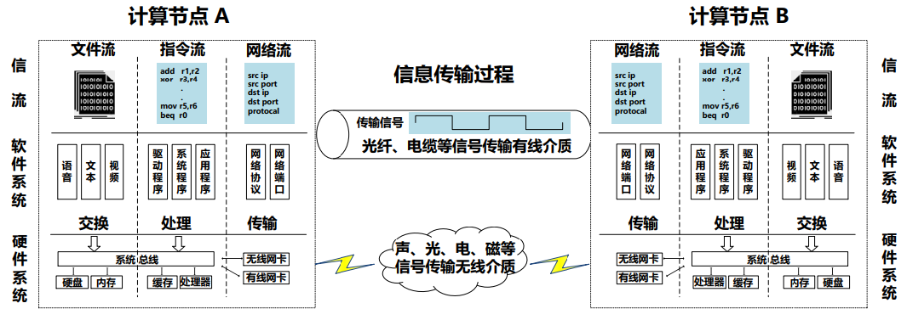
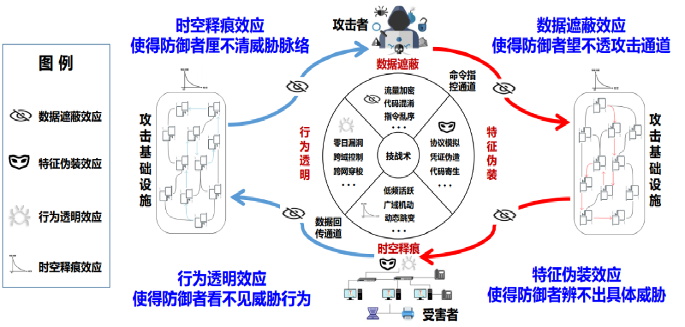
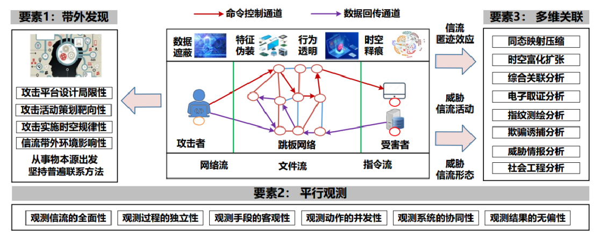

# 密态对抗

## 提出背景

> “密态对抗”这一术语最早由浙江大学张帆教授、郭世泽院士和赵新杰老师提出，发表在《中国计算机学会通讯》2023年3月，第3期，第19卷上。

今天的互联网，在做了更多的保密措施和加密措施之外，也使得攻击行为同样更加隐蔽。古话说“道高一尺魔高一丈”，攻方和守方，一直都在处于博弈之中，展开斗智斗勇的竞赛。近年来我国的很多企业、关基重保单位都遭遇过不同程度的网络攻击。有些攻击成功了，有些攻击失败了。包括前段时间闹得比较大的DeepSeek遭到大规模DDoS攻击等，也是让大家把视线再次拉到网络安全问题上来。很多大型央国企需要定期组织护网行动，开展攻防演练发现问题。现在的这些攻击方，其攻击路线和攻击手段越来越隐蔽，这种高隐蔽威胁行为的特点被称作**匿迹**，而这种匿迹后的状态被称作**密态**。

**网络空间威胁是指任何可能通过诸如未授权 的访问、破坏、披露信息或者拒绝服务等手段，对信息系统产生不利影响的情况或事件**。 在威胁分析与威胁情报这方面，用的比较多的方法就是诸如**钻石模型**、**杀伤链模型**、**ATT&CK**等。这些威胁分析方法我们会在后面再讨论，它们想探讨的是攻击者的攻击意图和**技战术分析**（Tatical Techniques and Procedures)，简称TTP。

信息在网络中传输时，同样是二进制的信号流，但它们能传输数据、能传输指令、能传输网络流量。文件流、指令流、网络流等可统称为**信流**。信流在网络空间快速流动和变换，从而实现信息的传输、处理和交换。不同的内容在攻击路径中起到了不同的作用。因此，对攻防的研判要从不同角度结合起来去分析。而这些信流在网络当中，不仅隐藏了恶意行为的存在，甚至能把自身隐藏起来，使得工程师更难发现它们，这是一种典型的**匿迹**。

## 匿迹机理

高隐蔽网络威胁具有六个大的特性：

- **隐蔽性**：通过各种手段绕过安全检查，难以被发现
- **复杂性**：攻击手段和技巧复杂，使用多种方式进行攻击
- **持续性**：威胁在目标网络或系统内长期存在，持续破坏系统或传输数据，难以察觉
- **针对性**：威胁不会盲目攻击，往往针对一个高价值目标
- **定制性**：威胁往往是针对目标网络或系统的特定弱点而设计，攻击策略高度定制化
- **阶段性**：威胁不直接攻击，利用第三方服务器或网站做跳板

 通过分析总结网络空间高隐蔽威胁在攻击通道、武器、漏洞、痕迹等方面的隐匿特点，张帆老师他们认为信流匿迹主要是有四种主要形式：**数据遮蔽、特征伪装、行为透明、时空释痕**。

- 数据遮蔽效应，主要包括流加密（攻击命令控制和数据回传通道使用高强度密码算法或协议，对通信内容进行加密）、代码混淆、指令乱序等盲化遮蔽，使防御者望不透攻击通道。
- 特征伪装效应，主要包括协议模拟（攻击通道伪装成TCP、UDP、ICMP等正常协议隐匿在网络流中）、代码寄生（攻击木马后门伪装在计算机固件、驱动、进程中）、凭证伪造等措施，使防御者在信流中辨不出具体的攻击通道、驻留武器等。
- 行为透明效应，主要包括攻击者在目标突破时使用大量的零日漏洞，在持久化控制中使用跨域控制和跨网穿梭等措施，使防御者看不见攻击过程。
- 时空释痕效应，主要特点包括低频次活跃、动态跳变、广域机动、攻击过程长时间控制等，攻击杀伤链的特征浓度在长时间、大尺度网络中被大大稀释，使防御者厘不清威胁，陷入难以在超大规模信流中发现稀疏动态威胁的困境。

而为了检测这些威胁，往往需要多方联动。比如：针对流量，做深度包检测、加密流量分析等；针对恶意代码，做逆向工程、静态-动态代码分析等；针对漏洞，从端网协同角度、做流量、做日志的联合分析等；针对威胁情报，做多源情报挖掘、威胁情报知识图谱等……，这一工作是需要多方联动的一个大工程。

## 密态对抗

密态对抗是一种方法和手段，是一种全新的技术体制。其核心具备三要素：**带外发现、平行观测、多维关联**。

- “带外发现”指的是挖掘发现密态信流客观存在的人机交互带外脆弱性；
- “平行观测”指的是密态对抗强调观测信流的全面性、观测过程的独立性、观测手段的客观性、观测动作的并发性、观测系统的协同性和观测结果的无偏性；
- “多维关联“指的是密态对抗需要全面地利用各类主被动平行观测手段，将发现的各种信流数据异常情况和防御者的知识经验结合起来，开展多维度的数据同态映射压缩、时空富化扩张、综合关联分析，引发信流数据与知识产生关联从而发现威胁。

日后，这种密态化趋势会越来越明显。将多方知识联动起来做研判，会越来越棘手，但也充满了乐趣和挑战性。

> 本节内容取材自：
>
> [1]. 张帆，赵新杰，郭世泽. 密态对抗—网络空间高隐蔽威胁透视的发展方向. 中国计算机学会通讯，2023 19(3):97-104.
>
> 另外，参考了中国科学院大学网络空间安全学院《网络安全数据分析基础》课程。

