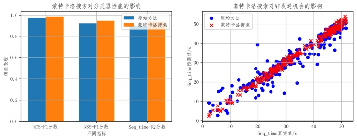
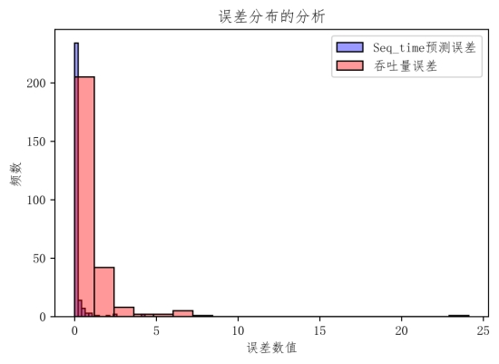

# 网络负载优化

> 本节内容是笔者参加2024年华为杯数学建模竞赛的论文作品节选。有几个小节因为公式太多我就不放上来了，哈哈，大家主要看个基础思路得了。

## 摘要

在无线局域网（WLAN）的广泛部署中，尤其是在高密度场景下，网络吞吐量成为评估系统性能的关键指标。然而，以往的研究并未对网络拓扑结构、节点间接收信号强度（RSSI）、信道接入机制以及干扰等因素对数据传输速率和吞吐量的影响进行深入分析，存在简化模型和理想化条件的局限性。如何准确预测和优化WLAN系统的吞吐量，成为当前亟待解决的关键问题。基于此，本文对以下问题进行探究。

对于问题一，这是一个回归问题，需要对AP发送机会也就是对Seq_time进行预测。针对这一问题，提出了APSelector模型，基于改进粒子群算法将特征重要性、模型性能、计算负载、网络环境视作优化目标，计算负载降低了15%。为了提高预测精度，设计了一种基于改进梯度提升树模型的方法，达到R2为0.89。但这一方法仍然面临高维稀疏数据与不定长序列场景下的挑战。对此，从真实物理场景的角度出发，提出了基于马尔可夫随机过程的MAC帧引导的数据流传输时间修正模型，将预测模型的R2分数提高到0.93。最终得到的CDF曲线中，当P>0.9时我们的误差值为0.2731。

对于问题二，这是一个分类问题。在对数据的分析过程中，发现样本失衡问题显著，这种现象会降低模型性能。针对这一问题，提出了基于改进CTGAN算法进行面向网络场景下的数据增强方法，基于生成对抗网络实现数据增强，将分类模型的F1分数分别从0.50和0.63均提升至0.95以上。与此同时，为了提高分类器预测性能，通过蒙特卡洛搜索法针对发送机会进行有约束优化，发现这一框架同时促进了分类模型和回归模型的性能，F1分数分别进一步提高了0.012和0.025，seq_time的回归模型R2分数提高了0.04。

对于问题三，这是一个回归问题。前面的分析成果实现了对系统吞吐量的建模与预测，这对网络规划、资源调度和性能优化提供了科学依据。但通过对模型的进一步分析发现，模型在处理时空特性数据时存在局限性，因此，设计了一种基于STGCN的节点RSSI时空信息表示模型，将时空特征引入模型从而实现了对系统吞吐量的更准确预测，R2达到了0.96742。最终得到的CDF曲线中，当P>0.9时我们的误差值为0.3780。

模型的建立与求解，不仅提高了WLAN系统吞吐量预测的准确性，而且能面向实际网络部署实现性能优化，具有重要的现实意义。相关预测结果已经写入附件中。

**关键词**：WLAN，系统吞吐量预测，改进粒子群算法，改进梯度提升树模型，马尔可夫随机过程，CTGAN，蒙特卡洛搜索法，STGCN

## 一. 问题重述

### 1.1 问题背景

无线局域网（WLAN）作为现代通信技术的重要组成部分，通过无线信道连接多个设备，实现数据的无线传输。在WLAN中，无线接入点（AP）作为网络的核心设备，负责向多个站点（STA）发送和接收数据。随着Wi-Fi技术的不断演进，从最初的IEEE 802.11标准到如今的Wi-Fi 7，WLAN的传输速率和覆盖范围得到了显著提升。然而，在高密度部署场景下，节点密集度增加，相邻小区覆盖范围重叠，导致干扰和碰撞问题日益突出，实际部署中的数据传输速率和吞吐量受到严重影响。因此，如何准确预测和优化WLAN系统的吞吐量，成为当前亟待解决的关键问题。

WLAN系统吞吐量的预测与优化，本质上需要深入理解网络拓扑结构、节点间接收信号强度（RSSI）、信道接入机制以及干扰等因素对数据传输速率和吞吐量的影响。问题将基于实测数据，分析这些因素与吞吐量之间的复杂关系，并构建预测模型。问题所给出的测试拓扑结构如图1所示：

 

**图1  测试拓扑结构图**

在WLAN吞吐量预测与优化领域，已有大量研究工作。前人通过仿真和实验手段，分析了不同网络参数对吞吐量的影响，并提出了多种优化策略[1,2]。然而，这些研究大多基于理想化条件或简化模型，难以准确反映实际部署中的复杂情况。此外，随着Wi-Fi技术的快速发展，新的标准和协议不断涌现，对吞吐量预测和优化提出了新的挑战。因此，本研究旨在结合实测数据和最新技术进展，构建更加准确和实用的吞吐量预测模型。

在WLAN吞吐量建模与优化过程中，面临诸多挑战。网络拓扑结构和节点间RSSI的复杂性使得特征提取和模型构建变得困难。信道接入机制和干扰因素的动态变化增加了预测的不确定性。不同场景下的业务需求和网络环境差异对吞吐量预测模型的泛化能力提出了更高要求。因此，如何克服这些挑战，构建鲁棒性强、预测精度高的吞吐量预测模型，是本研究需要解决的关键问题。

### 1.2 问题提出

**问题一：WLAN组网中的吞吐量预测与优化**

在无线局域网（WLAN）的广泛部署中，尤其是在高密度场景下，如办公、教育、医疗和工业制造等环境，网络吞吐量成为评估系统性能的关键指标。吞吐量指的是单位时间内成功发送的比特数，直接影响了用户的业务体验和数据传输效率。然而，随着节点密度的增加，相邻小区覆盖范围的重叠导致干扰和碰撞问题愈发严重，实际部署中的带宽和数据传输速率大幅下降。因此，精准和快速的吞吐量预测成为优化WLAN系统、提升性能的重要基础。本问题期望通过基于WLAN实测数据的分析，深入探讨网络拓扑、节点间RSSI、信道接入机制、干扰等因素对吞吐量的影响，从而构建有效的吞吐量预测模型，为设计高性能的WLAN系统提供技术支持。

**问题二：AP发送数据（MCS, NSS）选择的建模与预测**

在WLAN的实际运行中，AP（无线接入点）会根据自适应调制编码（AMC）算法动态调整发送速率，以适应不同的信道条件和业务需求。这一过程中，AP会采用多种（MCS, NSS）组合进行数据传输，其中（MCS, NSS）分别代表调制编码方案和空间流数。为了更准确地理解AP在复杂环境下的传输行为，问题二要求基于实测数据中的RSSI信息和门限信息，对AP发送数据选用最多次数的（MCS, NSS）进行建模。这一建模过程将帮助分析影响AP选择特定（MCS, NSS）的关键因素，并通过测试集数据预测新场景下AP的（MCS, NSS）选择，为网络优化和资源分配提供决策依据。

**问题三：系统吞吐量的建模与预测**

在WLAN组网中，系统吞吐量是衡量网络整体性能的关键指标。为了进一步提升WLAN系统的性能，问题三要求结合前两个问题的分析成果，对系统吞吐量进行建模。该模型将综合考虑网络拓扑、业务流量、信道接入机制、干扰等多种因素，以实测数据为基础，构建能够准确预测系统吞吐量的数学模型。通过该模型，可以对不同部署场景下的WLAN系统吞吐量进行预测，为网络规划、资源调度和性能优化提供科学依据。此外，模型还可以进一步分析各因素对吞吐量的影响程度，为WLAN系统的持续优化提供方向性指导。

## 二. 问题分析

### 2.1 问题一的分析

问题一需要对AP发送机会进行建模，也就是对Seq_time进行预测，是一个数据驱动的回归问题。对于这一问题，前人利用多种方法做出了一些研究。传统方法形如基于信道接入机制和网络拓扑的分析[3]，这些方法难以处理高维稀疏数据和动态变化的网络环境。随着机器学习的发展，数据驱动方法被广泛用于此类问题。例如，研究者们利用随机森林回归模型[4]和决策树等[5]机器学习方法对AP发送机会进行了建模，这些研究通过特征提取，如信道、带宽、流量、发送功率等，来提高预测的准确性。这些研究虽然在一定程度上提高了预测精度，但仍然面临挑战，尤其是在WLAN环境中采集的高维稀疏数据与不定长序列场景下，如何有效解决预测问题成为AP发送机会建模任务的重要挑战。

针对随机选择或单排序难以对复杂的网络特征进行特征选择问题，为了在特征选择时引入计算负载与网络环境中真实数据传输性能的评估，提出APSelector模型。这一方法基于改进粒子群算法将特征重要性、模型性能、计算负载、网络环境视作优化目标，将特征选择建模为一个多目标整数规划问题进行求解。我们认为，该方法可以在保证准确率与网络环境行为不失真的情况下提高计算效率。这一方法[6]也证明了优化方法能在特征选择任务上有突出表现。

针对AP机会预测问题，使用改进的梯度提升树模型对回归任务进行建模预测。通过对数据的分析，结合特征维度、稀疏性与数据体量来看，以集成学习为代表的机器学习模型相比于深度学习模型有着更好的性能。而对于不定长的RSSI序列特征建模，由于序列方差与变异系数并不大，我们通过取平均值的方式即可描述。WLAN中AP发送数据的机会受多个因素的影响，主要包括节点间的接收信号强度（RSSI），信干噪比（SINR），传输时间，信道接入机制等，将其引入到一个综合的数学模型中，可以成功预测。

纯粹的数据驱动方法难以考虑由于信道占用或碰撞引发的时延增加，即：难以对真实物理场景下的规律进行建模。数据包排队发送、时延等待、碰撞等一系列行为可以被描述为一个随机过程，因此，针对上述挑战，我们基于马尔可夫随机过程，提出MAC帧引导的数据流传输时间修正模型。通过真实场景物理规律的引入，模型的预测结果可以被大大提升。

### 2.2 问题二的分析

问题二需要对最优(MCS,NSS)进行选择，也就是对最优物理层传输速率进行预测，这是一个数据驱动的分类问题。针对这一问题，前人已经采用了多种方法进行研究。传统方法包括基于信道状态信息的调制和编码方案选择[7]，这些方法往往依赖于固定的模型，难以适应无线环境的动态变化。随着机器学习技术的发展，数据驱动的方法逐渐被广泛应用于此类问题。例如，有研究利用深度学习模型，如卷积神经网络[8]（CNN）和递归神经网络[9]（RNN），对MCS和NSS的预测进行了建模。这些研究表明，深度学习可以有效捕捉复杂的信道特性，从而提高预测的准确性。尽管这些研究在一定程度上提升了预测性能，但在实际应用中仍面临挑战，尤其是在高密度WLAN环境中，如何快速准确地选择MCS和NSS以优化吞吐率仍然是一个重要问题。

针对测试数据中广泛存在的样本失衡问题，提出基于CTGAN算法进行面向网络场景下的数据增强。CTGAN方法[10]能有效解决表格类数据的数据生成，从而针对特定类实现数据增强。通过与SMOTE插值算法的对比实验表明，数据增强能有效通过提高F1分数解决样本失衡问题导致的模型性能低。

针对分类器预测性能受限问题，通过问题一中提出的改进梯度提升树算法获得（MCS,NSS）初始预测解，将二者作为预测Seq_time的自变量，通过蒙特卡洛搜索法针对发送机会进行有约束优化来引导模型提高预测性能。

### 2.3 问题三的分析

问题三需要对WLAN场景下的吞吐量进行预测，这是一个回归问题。对于这一问题，前人利用基于信道状态信息的分析方法做出了一些研究。传统方法形如基于信道容量和干扰模型的分析[11]，这些方法难以适应快速变化的无线环境。随着机器学习的发展，数据驱动方法被广泛用于此类问题。例如，研究者们利用支持向量机(SVM)[12]、随机森林(RF)[13]和深度学习[14]等机器学习方法对吞吐量进行了建模和预测。这些研究虽然在一定程度上提高了预测的准确性，但仍然面临着如何在动态变化的WLAN环境中实时准确地预测吞吐量的重要挑战。

针对吞吐量预测任务，基于前面提到的改进梯度提升树算法进行预测。与此同时，我们注意到测试的网络拓扑是特定的，但每个设备在通信时都在接收或发送不定长的序列数据，呈现出典型的时空特性。这样的时空特性造成了原始数据稀疏，从而影响机器学习模型的性能。另外，丰富的时空特征信息能更加有效地表示节点的RSSI特征。基于上述洞察，我们提出基于STGCN的节点RSSI时空信息表示模型，通过时空图卷积操作学习节点RSSI特征并引入模型。这一特征将丰富原始数据的信息量，从而提高预测性能。

不同问题的模型之间关系架构如图2所示：

 

**图2  模型间关系架构图**

问题一是整个问题的基础，为问题二的搜索提供了主要框架，而问题一和问题二的准确预测也使得问题三能够被合理解决。

## 三. 模型假设

为使得建模过程更简洁合理，针对研究问题作出以下几条假设：

1. 假设网络中的流量模式在一段时间内是稳定的。这有助于简化模型，避免因流量模式的快速变化而导致的复杂性，同时通过对RSSI序列的分析，信号的方差并不大，在短时间内确实相对稳定。

2. 假设AP和STA的硬件性能是一致的。这样可以排除硬件性能差异对网络性能的影响，使模型更专注于无线通信协议和信道条件。

3. 假设网络中的所有节点都以最大努力进行传输。这一假设排除了节点可能由于策略性行为而保留传输能力的情况，使得设备的数据传输能力能够被模型充分估计。

4. 假设AP的地理位置是固定的。固定AP位置有助于简化网络拓扑结构，便于分析节点间的信号强度和干扰模式。

5. 假设数据包大小是固定的。虽然实际中数据包大小多变，但假设固定大小可以简化AMC算法的分析，并且可以基于最常见的数据包大小来进行假设。若考虑数据包大小随协议信息的不同，则仅凭提供的链路层测试数据无法充分估计传输时间。

## 四. 符号约定

> 这一部分大家要不直接看正文得了哈哈

## 五. 模型建立与求解

### 5.1 问题一的建立与求解

#### 5.1.1 数据预处理

真实WLAN场景下采集的链路层数据存在大量缺失特征，且维度较为稀疏。在采集过程中，由于网络环境变化或意外，还可能出现异常数据。这些现象对后续问题的建模会产生重要影响，因此，必须对原始数据进行预处理，使处理后数据能够贴合问题的具体场景。我们采用的预处理流程主要包括规范化数据、处理缺失值、异常数据处理等操作。以下是我们进行数据预处理的几个关键步骤：

1. 离散型特征的独热编码

独热编码是一种基本的编码方式，其将分类变量转换为仅包含0和1的二元特征，该方法通常用于当一个特征只有两种状态时。我们将训练集和测试集中对应的TCP协议编码为0，UDP协议编码为1，以简化模型的复杂度，同时保留特征的分类信息。与此同时，其他离散特征诸如MAC地址、loc区位等，在后续数据分析过程中也可能会对问题产生影响。尽管链路层的MAC帧以广播的形式传输，携带的报文信息中也可能带有MAC地址信息，因此，也通过独热编码的方式进行标签化。

2. 连续性数据的规约

数据规约的目的是以消除不同数量级和量纲带来的影响，并提高模型的收敛速度。我们采用了min-max规约与Z-Score规约相结合的方法对训练集和测试集中的连续性数据进行处理，将所有特征的尺度统一到均值为0，标准差为1的标准正态分布。具体操作形如：

|  | ()   |
| --------------------------------------------------------- | ---- |
|                                                           |      |

3. 不定长序列的处理

在训练集和测试集中，ap_from_ap_0_sum_ant_rssi、ap_from_ap_0_max_ant_rssi等特征为不定长序列，而序列的长度变化不大，且序列中的元素方差很小，则序列的平均值可以在一定程度上代表整个序列的特征，因此我们采用取序列均值的方法将不定长序列转换为定长序列。该方法可以保留序列的主要信息，同时减少数据的维度。同时，我们对训练集和测试集中列表数据的长度（即AP发送数据的数量、STA发送数据的数量）进行统计，作为补充特征分别添加至原训练集和原测试集中。

4. 缺失数据的处理

训练集和测试集中的缺失数据表示网络没有流量通过，因此我们将所有的缺失值替换为0，该方法不会引入额外的偏差，同时也保持了数据的完整性。

5. 异常数据检测

我们通过绘制箱线图的方法检测训练集和测试集中的异常数据。箱线图（Boxplot）是一种用于展示数据分布特征的统计图表，它能够直观地显示数据的最小值、第一四分位数（Q1）、中位数（Q2）、第三四分位数（Q3）和最大值，以及异常值。箱线图法检测异常数据的原理基于四分位数和四分位距（Interquartile Range, IQR）的概念，具体步骤如下：

1）计算四分位数：

l Q1（第一四分位数）：将数据集分为两半的值，位于Q1以下的数据占全部数据的25%。

l Q2（中位数）：将数据集分为两半的值，位于Q2以下的数据占全部数据的50%。

l Q3（第三四分位数）：位于Q3以上的数据占全部数据的75%。

2）计算四分位距（IQR）：IQR = Q3 - Q1，四分位距是第三四分位数与第一四分位数之间的差值，它表示数据集中间50%数据的分布范围。

3）确定异常值的阈值：下界为Q1 - 1.5 * IQR，上界为Q3 + 1.5 * IQR，这个范围被认为是数据的“正常”分布区域。任何低于下界或高于上界的值都被认为是潜在的异常值。

4）识别异常值：位于下界以下或上界以上的数据点被认为是异常值。在箱线图中，这些异常值通常以图表之外的点表示。

5）可视化：箱线图通过“箱线范围”（从Q1到下界，从上界到Q3）来表示IQR范围。胡须之外的点是异常值。

 

**图3  不同变量的箱线图**

由上述箱线图3可知，im_ant_rssi、sta_from_ap_0_max_ant_rssi等变量存在分布于“胡须”之外的点，说明其中存在异常值，我们利用平均值对异常值进行替换。

在数据预处理的基础上，为了直观地显示数据集中不同变量之间的相关性强弱，并帮助识别与目标变量高度相关的特征，我们通过绘制相关性热力图的方式进行分析。由于变量基本通过正态性检验，因此可以通过皮尔逊相关系数探索两个变量之间的相关性：

|  | ()   |
| --------------------------------------------------------- | ---- |
|                                                           |      |

公式中，r表示相关系数，Cov表示协方差，D表示方差。在此基础上绘制热力图，结果如下：

 

**图4  相关系数热力图**

在上述相关系数热力图4中，颜色的深浅通常表示相关性的强度，颜色越接近红色表示正相关性越强，颜色越接近蓝色表示负相关性越强，颜色的深浅（即相关系数的绝对值）可以表示变量之间相关性的强度。在无线网络中，当STA在多个AP之间移动时，会触发漫游机制以确保STA能够无缝连接到最佳的AP。这个过程中，AP和STA之间的信号强度是一个重要的考量因素。为了确保STA在漫游过程中能够保持稳定的通信质量，网络管理系统会综合考虑各个AP的信号强度、负载情况等因素来做出漫游决策。因此，在漫游过程中，AP发送数据的强度也可能会根据STA的当前位置和信号强度进行调整。从图中可以看出，AP发送数据的强度和STA发送数据的强度之间具有很强的相关性，也和事实比较相符。

#### 5.1.2 APSelector：一种基于改进粒子群算法的特征选择模型

> 这一部分其实借鉴了我的师兄在IPCCC2024上发表的一篇文章ReloSelector，但是那个主要是针对物联网环境恶意流量分类任务的一个特征工程手法。当时比赛的时候还没发表所以就没引用，欢迎大家关注！

为了实现对AP发送机会的精准预测，需要从稀疏的特征维度中选择核心特征并解释，这需要一个高效的特征选择模型。然而，传统的特征选择方法（如过滤法，包装法，嵌入法，主成分分析法等[15]）的缺点也十分明显。过滤法通常只考虑单个特征与目标变量之间的相关性，而忽略了特征之间的相互作用和冗余性。包装法每次选择或排除特征后都需要重新训练模型来评估特征子集的性能，计算量较大，耗时较长。而嵌入法的性能受到所使用的学习算法的影响，不同的算法可能会产生不同的特征重要性评估结果。因此在WLAN真实场景下如何高效、快速地选择特征进行实时预测成为了一项挑战。

面对真实网络场景下预测任务中的特征选择，前人已进行了多方面的研究，主要集中在两个方向：基于最小化特征数量的方法和基于成本敏感的特征选择方法。前者旨在保持高分类能力的同时最小化特征数量，例如，Chohra等提出的CHAMELEON方法利用粒子群优化（PSO）和集成学习方法选择流量特征进行异常检测[16]。然而，这些方法主要关注于减少特征数量，忽略了特征计算的成本，这在资源受限的物联网（IoT）场景中尤为重要。而后者在选择特征时会考虑特征的成本，如Jiang等研究了成本敏感特征选择方法，提出了一种新的评价函数，将测试成本和分类准确率结合起来，实现多目标优化转化为单目标优化[17]。尽管现有研究在特征选择方面取得了一定进展，但它们在处理AP发送时长特征选择时仍存在不足。一方面，基于最小化特征数量的方法未能充分考虑特征计算成本；另一方面，基于成本敏感的特征选择方法尚未充分适应WLAN环境的具体需求。

在WLAN环境中，一旦真实场景数据表现得比测试用例规模更大，则在进行特征选择时除了要考虑到特征重要性分数和模型表现，还要考虑到计算开销，并且要能够在真实网络环境中保证选择特征时数据传输速率不失真。因此，我们提出APSelector模型。这一模型将特征的选择抽象为0-1变量，通过构造目标函数将特征选择任务转化为一个多目标整数规划问题，利用改进粒子群算法进行求解。APSelector不仅考虑到特征重要性以及预测模型的性能，还考虑到模型的计算开销，以及选择的预测特征对网络传输性能描述的影响。

粒子群算法最初是为了模拟鸟群的运动，而通过对动物社会行为的观察，发现在群体中对信息的社会共享提供一个演化的优势，并以此作为开发算法的基础[18]。通过加入近邻的速度匹配、并考虑了多维搜索和根据距离的加速，形成了粒子群算法的最初版本。之后引入了惯性权重**w**来更好的控制开发和探索，形成了标准版本。

现在假设一群鸟在一块有食物的区域内，它们都不知道食物在哪里，但知道当前位置与食物的距离。最简单的方法就是搜寻目前离食物最近的鸟的区域。把这个区域看做是函数的搜索空间，每个鸟被抽象为一个粒子（物理意义上的质点），每个粒子有一个适应度和速度描述飞行方向和距离。粒子通过分析当前最优粒子在解空间中的运动过程去搜索最优解。设微粒群体规模为N，其中每个微粒在D维空间中的坐标位置可表示为Xi=(xi1,xi2,…,xiD)，微粒i的速度定义为每次迭代中微粒移动的距离，表示为Vi=(vi1,vi2,…,viD)， Pi表示微粒i所经历的最好位置，Pg为群体中所有微粒所经过的最好位置，则微粒i在第d维子空间中的飞行速度vid根据下式进行调整：

 

|  | ()   |
| --------------------------------------------------------- | ---- |
|                                                           |      |

 

在这个过程中，每次运动的时间间隔被视为单位1，那么速度实际上也可以用于描述下一个时间间隔的移动方向和移动距离。

 

|  | ()   |
| --------------------------------------------------------- | ---- |
|                                                           |      |

 

第一项为微粒先前速度乘一个权值进行加速，表示微粒对当前自 身速度状态的信任，依据自身的速度进行惯性运动，因此称这个 权值为惯性权值 第二项为微粒当前位置与自身最优位置之间的距离，为认知部分，表示微粒本身的思考，即微粒的运动来源于自己经验的部分 第三项为微粒当前位置与群体最优位置之间的距离，为社会部分，表示微粒间的信息共享与相互合作，即微粒的运动中来源于群体 中其他微粒经验的部分。

APSelector模型将特征选择的目标拆解为以下四个组成部分：

第一，预测模型的误差：由于Seq_time的预测是一个回归任务，选择MSE作为预测模型的评价准则。为了保证模型性能良好，使用XGBoost模型作为特征选择中的基准模型。目标函数可表达为：

|  | ()   |
| --------------------------------------------------------- | ---- |
|                                                           |      |

第二，总特征重要性分数：XGBoost是一种基于树形结构的集成学习模型，本身可通过基尼指数计算出特征的重要性分数。利用XGBoost模型给出特征分数后，目标为选择特征对应的总特征分数尽可能大，即：

|  | ()   |
| ---------------------------------------------------------- | ---- |
|                                                            |      |

第三，模型复杂性：作为一种基于Boosting策略的算法，XGBoost模型的基学习器是逐渐迭代，那么衡量模型复杂性只需要分析最后一个梯度提升树的阶数即可。模型复杂性代表了计算开销，需要尽可能小：

|  | ()   |
| ---------------------------------------------------------- | ---- |
|                                                            |      |

第四，网络流量的传输性能：预测的seq_time可以推算出AP和STA交换数据时单个数据包的传输性能，保证性能尽可能优，即使得预测数据传输率尽可能高：

|  | ()   |
| ---------------------------------------------------------- | ---- |
|                                                            |      |

问题可抽象为一个多目标整数规划模型：

|  | ()   |
| ---------------------------------------------------------- | ---- |
|                                                            |      |

为了将四个目标函数组合到一起，通过构造成对比较矩阵并使用AHP法得到四个特征的权重，使用加权求和法即可得到最终的目标函数。对四个目标构造成对比较矩阵A如下：

|  | ()   |
| ---------------------------------------------------------- | ---- |
|                                                            |      |

经计算，得到一致性指标CI=0.0359，一致性比例CR=0.0403 < 0.10，所以一致性可以接受。归一化之后，得到模型误差损失，总特征重要性分数，模型复杂性，网络流量传输性能四个目标的权重分别为w1=0.1514，w2=0.2016，w3=0.5545，w4=0.0925。由此，可抽象出特征选择的核心优化问题：

|  | ()   |
| ---------------------------------------------------------- | ---- |
|                                                            |      |

基于改进粒子群算法，APSelector的算法伪代码如下所示。

 

在XGBoost模型的基础上，已经可以通过基准模型给出每个特征的基尼指数，将条形图绘制如图5所示：

 

**图5  各个特征的基尼指数图**

通过XGBoost模型计算得到的基尼指数，可以初步了解各特征的重要性程度及排序。其中，对AP发送机会影响比较重要的特征例如eirp, sta_mac, other_air_time等以及RSSI特征。经过APSelector测试，我们选取了25个最重要的特征，并与XGBoost给出的前25名进行对比，如表1所示：

**表1  两种模型所选特征对比**

| 模型所选特征                | XGBoost内部特征             |
| --------------------------- | --------------------------- |
| eirp                        | eirp                        |
| sta_mac                     | sta_mac                     |
| other_air_time              | other_air_time              |
| sta_from_0_rssi             | sta_from_ap_0_mean_ant_rssi |
| sta_from_1_rssi             | sta_from_0_rssi             |
| ap_from_ap_1_mean_ant_rssi  | sta_from_1_rssi             |
| nav                         | ap_from_ap_1_mean_ant_rssi  |
| num_ampdu                   | nav                         |
| ppdu_dur                    | num_ampdu                   |
| sta_to_ap_2_sum_ant_rssi    | ppdu_dur                    |
| sta_to_ap_2_mean_ant_rssi   | per                         |
| sta_from_ap_2_sum_ant_rssi  | sta_from_2_rssi             |
| loc_id                      | sta_from_ap_2_max_ant_rssi  |
| sta_from_ap_1_max_ant_rssi  | sta_from_ap_0_max_ant_rssi  |
| sta_to_ap_2_max_ant_rssi    | sta_to_ap_2_sum_ant_rssi    |
| sta_to_ap_0_sum_ant_rssi    | sta_from_ap_0_sum_ant_rssi  |
| protocol                    | sta_to_ap_2_mean_ant_rssi   |
| sta_to_ap_1_mean_ant_rssi   | ap_from_ap_2_sum_ant_rssi   |
| sta_to_ap_0_mean_ant_rssi   | sta_from_ap_2_sum_ant_rssi  |
| sta_from_ap_1_sum_ant_rssi  | sta_from_ap_1_mean_ant_rssi |
| ap_from_ap_2_max_ant_rssi   | loc_id                      |
| sta_to_ap_0_max_ant_rssi    | ap_from_ap_1_sum_ant_rssi   |
| ap_from_ap_0_mean_ant_rssi  | sta_from_ap_1_max_ant_rssi  |
| ap_from_ap_0_sum_ant_rssi   | sta_to_ap_1_max_ant_rssi    |
| sta_from_ap_2_mean_ant_rssi | sta_to_ap_2_max_ant_rssi    |

从结果上看，APSelector兼顾了XGBoost的重要性排序，所选特征有相当一部分是一致的。不同的是，通过放弃几个排名相对靠前的特征，从而换取计算效率，这样的做法保证了在真实环境中的方法适用性。不同特征所得到的模型表现对比如图6所示：

 

**图6  不同特征所得到的模型表现对比图**

可以看到，使用全部特征、XGBoost的TopK特征与APSelector所表现的回归模型性能大致相当，而APSelector的训练时间和模型复杂度则明显更低，表现了更好的特性。关于目标函数的选择动机，我们作出如下分析：

模型误差损失是衡量模型预测结果与实际结果之间差异的重要指标。通过最小化误差损失，可以优化模型的预测准确性，使其在网络流量预测、异常检测等任务中表现更佳。

特征重要性分数揭示了不同特征对模型预测结果的影响程度。这有助于理解哪些网络特征（如带宽、延迟、丢包率等）对网络性能或流量模式具有显著影响。并且基于特征重要性分数，可以进行特征选择，即选择对模型预测结果贡献最大的特征，以简化模型结构、提高模型运行效率和预测准确性。

模型复杂性过高可能导致模型在训练数据上表现良好，但在未见过的数据上表现不佳，即过拟合现象。通过控制模型复杂性，可以在保证预测准确性的同时，提高模型的泛化能力。

网络流量传输性能是计算机网络性能的直接体现，包括吞吐量、延迟、抖动等关键指标。这些指标直接影响用户体验和网络应用的运行效率。通过监测和分析网络流量传输性能，可以及时发现网络瓶颈和潜在问题，进而优化网络配置和资源分配，提高网络的整体性能和稳定性。

#### 5.1.3 面向网络流量场景下改进梯度提升树算法的AP发送机会预测

以往关于预测AP发送机会的方法主要包括统计分析方法[19]，时间序列分析方法[20]，物理模型方法[21]，专家系统方法[22]等。但以往的方法还存在一定局限性，例如，统计分析方法对非线性关系和复杂模式的捕捉能力较弱，在数据量大或数据分布复杂时，预测精度可能下降。时间序列分析方法需要足够长的历史数据来建立稳定的模型，对于突发性的变化或异常值，预测能力可能受限。物理模型方法模型复杂度高，需要较深的专业知识和计算资源，对于实际网络环境的复杂性和多样性，模型可能难以完全准确描述。专家系统方法对规则库的构建和维护需要大量的人力投入；对于新的或未知的情况，预测能力可能受限。

传统的预测算法包括线性回归、逻辑回归、决策树、随机森林、支持向量机、朴素贝叶斯、K最近邻、K均值聚类等。这些算法各有优势和局限性：线性回归和逻辑回归模型简单、易于理解，但可能无法捕捉非线性关系；决策树易于理解和解释，但容易过拟合；随机森林通过集成多个决策树提高了准确性，但模型可能变得复杂且计算成本高；支持向量机在高维空间中表现良好，但对于大规模数据集计算成本高；朴素贝叶斯简单高效，但假设特征独立，这在现实中很少成立；K最近邻直观易懂，但计算成本高且对特征尺度敏感；K均值聚类适用于未标记数据，但需要预先指定簇的数量且可能收敛到局部最优解。

GBDT（Gradient Boosting Decision Tree）是一种集成学习方法，它采用Boosting策略和梯度提升技术来迭代构建多个弱学习器，最终组合成一个强大的预测模型。由Chen等人[23]提出的XGBoost是GBDT的一个高效实现，它不仅支持CART（Classification and Regression Trees）作为基学习器，还可以使用线性分类器（GBLinear）。

XGBoost的一个显著特点是其能够利用GPU的多线程进行并行计算，并且在算法上进行了优化，以提高模型的精度和鲁棒性。在XGBoost的目标函数中，加入了正则化项，特别是当基学习器为CART时，正则化项与树的叶子节点数量和叶子节点的值相关，这有助于在保持高准确率的同时增强模型的泛化能力。

与支持向量机（SVM）、高斯过程回归（Gaussian Process Regression）等传统机器学习算法相比，XGBoost算法展现出更高的准确度和更强的鲁棒性。XGBoost实现了梯度提升树框架（Gradient Boost Decision Tree Framework），使用CART决策树作为基学习器，适用于分类和回归问题，是机器学习领域中一种受欢迎的高性能算法。

XGBoost的基本形式为

|  | ()   |
| ---------------------------------------------------------- | ---- |
|                                                            |      |

XGBoost 学习的损失函数为下式：

|  | ()   |
| ---------------------------------------------------------- | ---- |
|                                                            |      |

在式子中，为正则化项，通常是树的复杂度(与树的深度 T 和节点权重 w 有关):

|  | ()   |
| ---------------------------------------------------------- | ---- |
|                                                            |      |

对它进行泰勒公式的三阶展开近似：

|  | ()   |
| ---------------------------------------------------------- | ---- |
|                                                            |      |

其中：

|  | ()   |
| ---------------------------------------------------------- | ---- |
|                                                            |      |

这一处理方法使得学习器的学习过程更加迅速，避免了拟合一个过于复杂的函数带来过高的计算复杂性。

XGBoost通过迭代地添加预测树（通常是CART回归树），每棵树都尝试纠正前一棵树的错误，以此来构建最终的强学习器。具体来说，它通过不断地拟合预测值与真实值之间的残差来逐步优化损失函数。

XGBoost的训练过程大致可以分为以下几个步骤：

（1）初始化：

首先，算法会初始化一个常数作为第一棵树的预测值（通常是所有样本真实值的均值）。

（2）迭代构建树：

然后，算法会进入迭代过程，每次迭代都会构建一棵新的树来拟合当前的残差。具体来说，算法会遍历每个特征及其可能的分裂点，计算分裂后的信息增益（或等价的增益函数），并选择增益最大的特征及其分裂点作为最优分裂。

（3）更新预测值：

在每棵树构建完成后，算法会将其预测值加到之前的预测值上，得到新的预测值。然后，算法会基于新的预测值和真实值计算新的残差，并进入下一轮迭代。

（4）停止条件：

迭代过程会一直持续下去，直到满足某个停止条件（如达到预设的树的数量、残差小于某个阈值等）。

将XGBoost算法的预测结果与线性回归、SVM、随机森林、GBDT、DNN的预测结果进行对比，分别计算平均平方误差（MSE）、均方根误差（RMSE）和决定系数（R2 score），结果如表2所示。综合考虑上述三个指标，XGBoost算法在RMSE和MSE以及R2 score上均表现最佳。这表明XGBoost算法在预测精度上具有优势，尤其是在误差的控制上。

**表2  不同方法的参数比较** 

|          | LR     | SVM       | RF     | GBDT   | XGB    | DNN    | CNN    | LSTM   |
| -------- | ------ | --------- | ------ | ------ | ------ | ------ | ------ | ------ |
| RMSE     | 7.19   | 12.922    | 4.187  | 4.339  | 4.175  | 7.352  | 6.573  | 7.921  |
| MSE      | 51.745 | 166.988   | 17.527 | 18.829 | 17.427 | 54.049 | 43.21  | 62.749 |
| R2 score | 0.69   | -5.37E-05 | 0.895  | 0.887  | 0.896  | 0.676  | 0.707  | 0.584  |
| CDF>0.9  | 0.5225 | 1.0788    | 0.2880 | 0.2993 | 0.2731 | 0.5103 | 0.5377 | 0.5812 |

绘制不同模型预测误差的箱线图，如图7所示。观察可以发现，XGBoost算法箱线图的中间线最低，说明其对应误差的中位数最小，预测准确率最高。同时，我们可以看到，XGBoost算法箱线图的长度（即数据的四分位数范围，IQR）很短，表示中间50%的误差数据紧密分布在中位数附近，数据的变异性较小，即XGBoost算法的预测结果较为稳定。

 

**图7  不同模型预测误差的箱线图**

在上述实验的基础上，我们用上述六种模型分别对TCP协议数据和UDP协议数据进行训练和预测，结果如图8的箱线图所示。从图中可以看出，XGBoost算法对TCP数据和UDP数据的预测结果准确率均位于前列。同时可以观察到，各模型对UDP数据预测的准确率整体上均优于对TCP数据预测的准确率。出现上述结果的主要原因为：

1）TCP协议是一种面向连接的点对点通信协议，它确保数据传输的顺序性和可靠性。在MAC层帧传输过程中，点对点通信机制特别注重数据传输的顺序性，并采用载波监听技术以避免冲突。然而，由于TCP协议在数据传输过程中可能会遇到碰撞，这可能导致传输延迟的不确定性增加。

2）相比之下，UDP协议是一种无连接的通信协议，它采用广播方式发送数据。即使节点A未能接收到来自节点B的UDP数据包，它仍然有可能接收到来自节点C的数据包。因此，在UDP通信中，单个数据包的丢失不会对整体通信产生显著影响。此外，由于提供的数据集中并未包含具体的PCAP报文信息，因此无法对具体的数据包传输情况进行详细分析。

 

**图8  不同模型对TCP/UDP协议数据的箱线图**

此外，我们绘制了如图9所示的测试集中AP发送机会预测误差的CDF 曲线，并对不同预测模型的CDF曲线进行对比。本图展示了线性回归、SVM、随机森林、GBDT、XGBoost和DNN算法在预测任务中的误差累积分布情况。横轴表示预测误差的值，纵轴表示预测误差小于或等于横轴值的样本比例。CDF曲线越陡峭，表示模型在误差控制上越集中；曲线越靠左，表示模型的平均误差越小。

曲线显示，XGBoost在低误差范围内表现良好，有较高比例的预测误差低于设定阈值。在误差小于1.5时，XGBoost的CDF曲线迅速上升，表明大部分预测误差都集中在较低的范围内。通过对比六条CDF曲线，可以观察到XGBoost算法在预测误差控制上表现最佳，GBDT次之，而SVW则在六个模型中表现最差。特别是在高置信度区间内，XGBoost的预测误差明显低于其他几个模型。

 

**图9  吞吐量预测误差的CDF 曲线**

最终得到的CDF曲线中，当P>0.9时我们的误差值为***\*0.2731\****。

### 5.2 问题二的建立与求解

#### 5.2.1 基于改进CTGAN的网络流量数据增强

通过绘制训练集中关于样本数量的热力图（如图13所示），可以发现，训练集中存在较为明显的样本失衡问题。例如，mcs为11的样本数显著多于其他样本数。若模型在不平衡的数据集上训练，它可能会偏向于多数类，从而忽视少数类的特征和模式，导致对少数类的预测不准确。

 

**图13  训练集中关于样本数量的热力图**

针对上述样本失衡问题，SMOTE是一种用于处理不平衡数据集的过采样方法[24]，它通过合成少数类样本来增加其数量，从而减少类别之间的不平衡。以下是SMOTE算法的基本原理：

1. 选择少数类样本：SMOTE算法专注于增加少数类的样本数量。首先，它会选择一个少数类样本，然后找到该样本的k个最近邻（kNN）。

2. 计算中间点：对于每一个最近邻样本，SMOTE算法会在原始样本和其最近邻样本之间创建新的样本点。这是通过在原始样本和其最近邻样本之间的线段上随机选择一个点来实现的，即通过插值生成新的样本。

3. 生成新样本：新的样本点是通过以下公式生成的：

 

其中，$\lambda$是在[0, 1]区间内随机选择的数。这意味着新样本是原始样本和其最近邻样本之间的一个点。

4. 重复过程：SMOTE算法重复上述过程，直到少数类的样本数量与多数类相等或达到用户指定的样本数量。

然而，SMOTE算法也存在一些潜在的缺点。由于SMOTE通过插值生成新的样本，这可能导致模型过拟合，尤其是在少数类样本数量较少时。并且如果少数类样本之间的距离较远，生成的新样本可能无法准确反映数据的真实分布，从而造成信息丢失。SMOTE可能会放大数据中的噪声，因为噪声点的最近邻也可能是噪声点，这会生成更多的噪声样本。它主要适用于分类问题，不适用于题目中的吞吐量等目标变量为连续值的回归问题。

CTGAN（Conditional Tabular GAN）模型相较于SMOTE算法，展现了显著的优势。SMOTE算法主要通过在少数类样本间进行插值来增加样本数量，而CTGAN则采用生成对抗网络（GAN）来学习整个数据分布，并生成新的合成样本[25]。这种方法不仅能够同时处理连续和分类变量，而且能够更准确地捕捉数据的复杂分布和结构，从而生成更高质量的合成数据。

CTGAN的核心优势在于其能够对表格数据的概率分布进行建模，生成与真实数据分布极为相似的合成数据。这一特性使得CTGAN在数据隐私保护、数据增强以及机器学习模型训练方面具有重要应用价值，尤其是在数据受限或敏感的场景中。通过生成高质量的合成数据，CTGAN不仅能够保护数据隐私，还能提高数据的利用效率，实现数据挖掘、模型训练和测试等多种应用场景。

最初，生成对抗网络（GAN）被设计用于生成非结构化的图像数据。CTGAN模型创新性地将GAN的理念引入到表格数据生成中，通过构建生成器（G）和鉴别器（D）的对抗学习机制。生成器的目标是产生尽可能接近真实数据分布的合成数据，而鉴别器则致力于区分生成数据和真实数据。在这一过程中，生成器和鉴别器通过不断的对抗学习进行优化，直至生成器能够生成足以欺骗鉴别器的高质量合成数据，这使得表格数据的生成变得更加灵活和高效。

CTGAN模型的工作流程包括以下几个关键步骤：

1. 数据预处理：首先对训练集的表格数据进行归一化处理，将连续数据转换为独热编码形式，以适应GAN的输入要求。

2. 条件生成器设计：通过引入条件向量，指导生成器生成满足特定条件的样本，增强模型的灵活性。

3. 模式归一化：对于连续数据，采用变分高斯混合模型估计其分布，并使用独热编码和标量值表示每个值，以确保数据的准确性。

4. 对抗训练：生成器和鉴别器通过对抗训练相互竞争，生成器学习如何生成更真实的数据，而鉴别器则学习如何更准确地区分真假数据。

5. 采样训练：为了解决类别不平衡问题，采用采样训练法，确保所有类别在训练过程中得到充分表示，从而提高模型的泛化能力。

在无线局域网（WLAN）环境下，不同接入点（AP）与站点（STA）之间的组网过程中进行吞吐量建模是一个复杂的问题。特别是在测试中，由于实际网络环境中的动态变化，如信道竞争、干扰、信号衰减等因素，导致吞吐量数据具有高度的不确定性和复杂性。此外，接收信号强度指示（RSSI）数据作为关键的网络性能指标，通常是不定长的序列，这给数据建模带来了额外的挑战。传统的CTGAN模型在处理此类不定长序列数据时面临困境，因为它主要针对固定长度的表格数据进行建模和生成。

为了克服这些挑战，我们提出了一种改进的CTGAN模型，该模型能够对RSSI序列的分布进行有效学习，并生成具有实际网络特征的合成数据。我们的思想是在CTGAN的生成器中引入一个序列处理模块，该模块能够捕捉序列数据的动态特性，并将其作为条件信息融入到数据生成过程中。通过这种方式，我们能够生成具有实际网络拓扑特征的合成吞吐量数据，从而为WLAN的性能分析和优化提供支持。

在无线网络环境中，数据的生成和应用需要考虑网络的时空特性。因此，我们对CTGAN进行了以下几方面的修正：

1. 序列数据处理：通过学习不定长序列的分布特性来处理RSSI序列数据，使生成数据在RSSI信息有关特征中能更加自然真实。

2. 条件信息融合：将处理后的序列信息作为条件信息输入到CTGAN的生成器中，指导生成过程，确保生成数据与实际网络条件相匹配。

3. 数据不平衡处理：采用采样训练策略，确保在生成过程中，所有类别的数据都能得到充分的表示，从而解决类别不平衡问题。

整体模型架构如图14所示：

 

**图14  模型架构图**

在WLAN吞吐率测试中，由于测试环境的复杂性和多变性，往往存在样本数据类别不平衡的问题。CTGAN模型可以应用于此场景，通过以下方式生成平衡的数据集：

1. 数据收集：收集WLAN吞吐率测试中的原始数据，包括不同条件下的吞吐率数据。

2. 数据预处理：对数据进行归一化处理，将连续的吞吐率值转换为适合CTGAN模型输入的形式。

3. 模型训练：使用CTGAN模型对预处理后的数据进行训练，生成器学习如何生成具有相似分布的合成吞吐率数据。

4. 样本平衡：通过CTGAN模型的采样训练策略，生成各个类别均衡的合成数据，以解决样本失衡问题。

5. 模型应用：将生成的平衡数据集用于机器学习模型的训练和测试，提高模型的泛化能力和预测准确性。

通过这种方式，CTGAN模型不仅能够提高数据的利用效率，还能够增强机器学习模型在复杂多变的WLAN环境中的性能。

下面，我们对样本失衡的数据集进行了三种不同的处理方式，并比较了它们在F1分数和预测准确率两个评估指标上的性能。这三种处理方式包括：不进行任何增强（原始数据），使用SMOTE算法进行过采样增强，以及使用CTGAN模型进行数据增强。从图表中可以看出，CTGAN在F1分数和预测准确率两个指标上都显著高于其他两种方法。这表明CTGAN在处理样本失衡问题时，能够有效地提高模型对少数类的识别能力，同时保持对多数类的准确预测。如图15所示：

 

**图15  数据增强分别对MCS，NSS分类器性能的影响**

出现上述结果是因为CTGAN通过学习数据的概率分布来生成合成数据，这有助于保持原始数据的分布特性，从而在增强数据集时不会引入偏差。相比之下，SMOTE虽然通过在少数类样本之间插值来增加样本数量，但它可能无法完全捕捉数据的复杂分布，尤其是在高维空间中。此外，SMOTE可能会引入过拟合的风险，因为它生成的样本完全依赖于现有的少数类样本。

#### 5.2.2 基于机器学习与蒙特卡洛搜索的最优（MCS,NSS）搜索

在通信领域，尤其是WLAN环境中，MCS和NSS是两个重要的技术参数，它们对数据传输的效率和可靠性有着直接影响。为了适应不同的信道条件而采用的调制和编码技术的组合。这些技术组合旨在提高数据传输的速率和可靠性，同时保持较低的误码率。MCS的选择基于当前的信道状况，如信号强度、干扰水平等，以确保数据传输的最佳性能[26]。在WLAN中，随着技术的演进（如从Wi-Fi 5到Wi-Fi 6再到Wi-Fi 7），MCS的选择范围不断扩大，支持更高的数据传输速率和更复杂的调制编码技术[27]。而NSS表示的是同时传输的独立数据流的数量[28]。通过增加NSS，可以在不增加频谱资源的情况下提高数据传输的吞吐量。

在组合优化和集合论中，MCS通常指的是给定一组集合和某些覆盖要求，如每个元素至少被某个集合覆盖，找到一个最小的集合子集来满足这些覆盖要求。为了将其转化为条件概率问题，可以假设有一个目标状态T（表示所有元素都被覆盖的状态），和一系列可能的选择Ai（代表不同的集合选择），每个选择都有一定的概率P(Ai)。我们的目标是找到一个覆盖集C，使得：P(T | C) 最大（即给定C的条件下，目标T被达成的概率最大）且|C|最小（C中集合的数量最少）。

对于NSS，假设我们有搜索空间S，其中包含一系列状态si，目标状态为T，从状态si到sj的转移有概率P(sj | si, a)，其中a是执行的动作或决策。目标是找到一个序列a1, a2, ..., an，使得最大化P(T∣s0, a1, a2,…,an)，其中s0是初始状态。

在无线局域网中，AP的发送机会受到多种因素的影响，其中MCS和NSS的选择尤为重要。二者共同决定了数据传输的速率。较高的MCS等级和较大的NSS值通常意味着更高的数据传输速率。信道质量越好（如RSSI值越高、干扰越小），AP就越有可能选择较高的MCS等级和较大的NSS值，从而提高数据传输的效率和可靠性。因此，在预测AP的发送机会时，需要考虑MCS和NSS的选择对数据传输速率的影响，以便更准确地估计AP能够发送的数据量。

20MHz带宽时，选用不同（MCS, NSS）组合的PHY Rate（Mbps）如下表3所示：

**表3  不同组合的PHY Rate比较**

| MCS  | 0    | 1    | 2    | 3    | 4     | 5     | 6     | 7     | 8     | 9     | 10    | 11    |
| ---- | ---- | ---- | ---- | ---- | ----- | ----- | ----- | ----- | ----- | ----- | ----- | ----- |
| NSS1 | 8.6  | 17.2 | 25.8 | 34.4 | 51.6  | 68.8  | 77.4  | 86.0  | 103.2 | 114.7 | 129.0 | 143.4 |
| NSS2 | 17.2 | 34.4 | 51.6 | 68.8 | 103.2 | 137.6 | 154.9 | 172.1 | 206.5 | 229.4 | 258.1 | 286.8 |

为了让发送概率最大，我们提出了以下函数，其中MCS和NSS的取值有所不同。

|  | ()   |
| ---------------------------------------------------------- | ---- |
|                                                            |      |

将每个可能的集合或集合组合作为特征，并构造一个标签来表示该集合是否属于最小覆盖集的一部分。使用XGBoost分类器来训练这些特征，目标是预测哪些集合会被选中以形成最小覆盖集。结合XGBoost的预测能力来指导启发式搜索算法，以更快地找到最小覆盖集。并且在搜索过程中使用XGBoost模型来评估当前候选解的质量，并据此调整搜索方向。得到的结果如下表4，表5所示。

**表4  NSS分类**

|              | precision   | recall      | f1-score    | support     |
| ------------ | ----------- | ----------- | ----------- | ----------- |
| 0            | 1           | 1           | 1           | 262         |
| 1            | 0.995934959 | 0.995934959 | 0.995934959 | 246         |
| 2            | 0.996336996 | 0.996336996 | 0.996336996 | 273         |
| F1 score     | 0.997439181 | 0.997439181 | 0.997439181 | 0.997439181 |
| macro avg    | 0.997423985 | 0.997423985 | 0.997423985 | 781         |
| weighted avg | 0.997439181 | 0.997439181 | 0.997439181 | 781         |

**表5  MCS分类**

|              | precision   | recall      | f1-score    | support     |
| ------------ | ----------- | ----------- | ----------- | ----------- |
| 0            | 1           | 1           | 1           | 145         |
| 3            | 1           | 1           | 1           | 126         |
| 4            | 0.942446043 | 0.97037037  | 0.95620438  | 135         |
| 5            | 0.96875     | 0.939393939 | 0.953846154 | 132         |
| 6            | 1           | 0.959731544 | 0.979452055 | 149         |
| 7            | 0.986111111 | 0.993006993 | 0.989547038 | 143         |
| 8            | 0.930769231 | 0.991803279 | 0.96031746  | 122         |
| 9            | 0.979591837 | 0.98630137  | 0.982935154 | 146         |
| 10           | 0.966942149 | 0.975       | 0.970954357 | 120         |
| 11           | 0.95890411  | 0.927152318 | 0.942760943 | 151         |
| F1 score     | 0.973703433 | 0.973703433 | 0.973703433 | 0.973703433 |
| macro avg    | 0.973351448 | 0.974275981 | 0.973601754 | 1369        |
| weighted avg | 0.974083957 | 0.973703433 | 0.973687037 | 1369        |

将分类器预测得到的MCS和NSS作为新的特征引入问题一基于APSelector构建的特征体系与预测模型中，得到Seq_time预测R2分数为0.9012。为了对MCS和NSS进行寻优，从而得到更小的误差，对于每个样本构造优化模型如下：

l 目标函数：以样本预测的误差为目标

l 决策变量：MCS值与NSS值

l 约束条件：MCS只能取0,1,2；NSS只能取1~12之间的整数

即，针对每一条测试数据，构造优化模型：

|  | ()   |
| ---------------------------------------------------------- | ---- |
|                                                            |      |

蒙特卡洛搜索，特别是蒙特卡洛树搜索，是一种结合了蒙特卡洛方法和树搜索的算法，用于在庞大的搜索空间中寻找近似最优解[29]。从根节点开始，根据某种策略递归地选择子节点，直到达到一个尚未完全展开的节点或叶子节点。这个过程平衡了“探索”（访问较少但可能具有潜力的节点）和“利用”（已知表现较好的节点）之间的权衡。如果达到的节点是一个未完全展开的节点（即存在未被访问过的子节点），则选择一个或多个子节点加入到搜索树中。这通常涉及评估可能的下一步行动，并将它们作为新的子节点添加到当前节点下。从扩展步骤中选择的一个新节点开始，进行一系列随机模拟，直到达到一个终止状态。在模拟过程中，通常使用默认策略来选择行动。将模拟的结果反向传播回搜索树的根节点，并更新路径上每个节点的统计数据。这些统计数据通常包括访问次数、胜利次数和总得分等，用于评估节点的价值。蒙特卡洛方法搜索的流程图如下所示。

 

**图16  蒙特卡洛方法搜索流程图**

在WLAN组网中网络吞吐量建模的研究中，我们采用了一种创新的方法，将机器学习预测与蒙特卡洛搜索法相结合，以提高对MCS和NSS的预测准确性，进而优化seq_time的预测。我们的核心思想是利用XGBoost算法对MCS和NSS进行初步预测，然后将这些预测结果作为特征输入到seq_time的回归模型中，通过蒙特卡洛搜索法进一步优化seq_time的预测结果。这种方法的优势在于能够实现分类任务和回归任务之间的相互促进，从而提高整体模型的性能。

在我们的实验中，XGBoost算法已经能够较为准确地预测MCS和NSS。然而，通过引入蒙特卡洛搜索法，我们观察到了显著的性能提升。具体来说，MCS的分类F1分数提高了0.012，NSS的F1分数提高了0.025。此外，当我们将预测得到的MCS和NSS作为特征引入seq_time的回归模型后，R2分数提高了0.04，表明我们的模型能够更好地捕捉数据帧序列时长的变化。

 

**图17  蒙特卡洛搜索对分类器性能和AP发送机会的影响**

我们认为，性能提升的背后有以下几个原因：

（1）特征增强：通过将MCS和NSS的预测结果作为特征，我们为seq_time的回归模型提供了额外的信息。这些信息有助于模型理解不同MCS和NSS对seq_time的影响，从而提高预测的准确性。

（2）蒙特卡洛搜索法的优势：蒙特卡洛搜索法通过随机抽样的方式探索可能的解空间，这种方法能够避免陷入局部最优解，并且在处理高维数据时表现出较好的鲁棒性。在我们的实验中，这种方法有助于模型在面对复杂的WLAN环境时做出更准确的预测。

（3）分类与回归的协同效应：通过将分类任务（MCS和NSS的预测）与回归任务（seq_time的预测）结合起来，我们创造了一个正反馈循环。分类任务的改进能够提高作为回归任务特征的预测质量，而回归任务的改进又能够反过来指导分类任务的优化。

（4）算法的互补性：XGBoost算法在处理结构化数据时表现出色，而蒙特卡洛搜索法在处理不确定性和随机性方面有其独特的优势。两者的结合实现了算法优势的互补，提高了模型对复杂现象的捕捉能力。

### 5.3 问题三的建立与求解

#### 5.3.1 基于改进梯度提升树的网络吞吐量预测

在移动通信技术的快速发展浪潮中，网络吞吐量预测技术已成为确保数据服务质量的关键。随着5G和B5G网络的商用化进程加速，研究者们正在努力开发更准确、更高效的吞吐量预测方法。在这一领域，机器学习和深度学习技术，尤其是长短期记忆网络（LSTM），因其在处理时间序列数据方面的优势而备受关注。例如，研究人员利用LTE网络中的TCP日志和吞吐量数据，通过滑动窗口方法创建输入数据，并训练了带有注意力机制的LSTM模型，以提高预测的准确性[30]。此外，为了应对5G和B5G网络的复杂性，研究提出了基于LSTM的流量预测模型，该模型不仅预测吞吐量，还结合当前网络状态来估计其他关键性能指标（KPIs），以进一步改善服务保障[31]。

Wi-Fi网络中的传输吞吐量预测同样是研究的热点。在一项研究中，评估了多种机器学习算法，包括多层感知器（MLP）、支持向量回归器（SVR）、决策树（DT）和随机森林（RF），以预测Wi-Fi网络中的传输吞吐量[Real-time throughput prediction for cognitive Wi-Fi networks]。研究结果显示，MLP算法在预测准确度上表现最佳，准确度高达96.2%。此外，一项新的基于经验条件的方法被提出，用于预测TCP移动数据网络中的吞吐量[32]。这种方法通过分析过去的网络吞吐量数据，预测未来的带宽变化，从而为视频上传者提供更准确的带宽预测。

在WLAN网络中，研究人员面临着新的挑战，因为这些网络的高速度和低延迟特性对吞吐量预测的准确性提出了更高的要求。为了满足这些要求，探索了结合多种机器学习技术来提高预测的准确性和效率[33]。同时，在超密集网络（UDNs）中，干扰是一个不可忽视的因素，它严重影响了小区边缘用户的体验以及网络的总吞吐量。为了解决这一问题，研究人员提出了一种基于大数据的预测资源分配方法，该方法通过预测信道状态来分配资源，在无干扰网络中可以实现显著的性能提升。

这些研究表明，通过应用机器学习和深度学习技术，可以显著提高网络吞吐量的预测准确性，为网络运营商提供更有效的网络管理和资源分配策略。随着技术的不断进步，未来的研究可能会进一步探索如何结合多种预测模型和算法，以实现更准确、更高效的网络吞吐量预测[34]。这些研究不仅推动了移动通信技术的发展，也为网络运营商提供了强有力的工具，以应对日益增长的数据流量和用户对服务质量的期望。

在WLAN中，网络吞吐量的优化是确保高效数据传输的关键。调制编码模式（MCS）、空间流数量（NSS）和接入点（AP）发送数据帧序列的总时长（Seq_time）是影响WLAN性能的三个核心变量。

MCS定义了无线通信中的调制和编码技术，直接影响数据传输速率和误码率。MCS的选择需要在数据传输速率和可靠性之间找到平衡点。高MCS值通常意味着更高的数据传输速率，但对信号干扰和衰减更敏感，可能导致更高的误码率。

NSS指的是在MIMO系统中同时传输的空间数据流的数量。增加NSS可以提高无线链路的容量和吞吐量，但这需要接收端也有相应数量的天线来正确接收这些流。在高密度部署场景下，NSS的选择需要考虑信道条件和干扰水平，以最大化系统性能。

Seq_time是指一个接入点在无线局域网中发送一系列数据帧所需的总时间。它包括实际的数据传输时间和由于信道竞争、碰撞或干扰导致的额外延迟。优化Seq_time可以减少数据传输的延迟，提高网络的吞吐量和效率。

在实际应用中，这些变量的优化需要考虑多种因素，包括信道条件、用户密度、干扰水平以及业务流量的类型和大小。通过机器学习和数据挖掘技术，可以更准确地预测这些变量对网络性能的影响，并据此进行相应的优化。例如，通过调整MCS和NSS的值，可以在不同的信道条件下实现最佳的吞吐量和可靠性。同时，通过减少Seq_time，可以提高网络的响应速度和整体效率。

在论文中，这三个变量被用于构建预测模型，以预测WLAN的吞吐量。通过对这些变量的分析和优化，可以提高无线网络的性能，特别是在高密度部署和复杂通信环境中。通过联网搜索，我们可以看到，MCS、NSS和Seq_time的优化对于提升WLAN系统性能至关重要。通过实测数据和机器学习模型，可以预测和优化这些变量，以实现更高的网络吞吐量和更好的用户体验。

我们采用了六种不同的机器学习方法来对WLAN的吞吐量进行预测，这些方法包括线性回归、支持向量机（SVM）、随机森林、梯度提升决策树（GBDT）、改进梯度提升树（XGB）和深度神经网络（DNN）。同时，为了全面比较这些方法，我们使用了三个关键的性能指标：均方根误差（RMSE）、均方误差（MSE）和决定系数（R² score），如图7所示。RMSE衡量的是预测值与实际值之间差异的标准差，提供了误差的大小；MSE衡量的是预测值与实际值之间差异的平方的平均值，对大误差有更高的惩罚；R² score衡量的是模型解释数据的能力，其值越接近1，表示模型的解释能力越强。

从结果可以看出，基于树的集成方法（如随机森林、GBDT和XGB）在预测WLAN吞吐量方面表现优于传统的线性模型、SVM和DNN，其中XGB算法结果无论是误差控制（RMSE和MSE）还是R2 score指标均达到了最优。

从实验结果中可以观察到，采用基于树的集成学习方法在预测无线局域网（WLAN）的吞吐量方面取得了显著的优势，相较于传统的线性模型、支持向量机（SVM）以及深度神经网络（DNN），这些集成方法展现出了更高的预测精度和更好的泛化能力。具体来说，随机森林、梯度提升决策树（GBDT）和极端梯度提升（XGB）这三种算法在预测任务中均表现出色，但XGB算法在所有关键性能指标上均达到了最优，无论是在误差控制方面（通过RMSE和MSE衡量）还是在模型拟合优度（通过R² score衡量）方面。

**表6  不同方法的误差和R2分数比较**

|          | LR       | SVM       | RF       | GBDT     | XGB      | DNN       |
| -------- | -------- | --------- | -------- | -------- | -------- | --------- |
| RMSE     | 29.8027  | 60.0020   | 17.6102  | 17.0740  | 14.1529  | 33.5991   |
| MSE      | 888.2023 | 3600.2439 | 303.8487 | 291.9222 | 200.3041 | 1128.9011 |
| R2 score | 0.7496   | -0.0150   | 0.9143   | 0.9177   | 0.9435   | 0.6817    |
| CDF>0.9  | 0.9547   | 23.0410   | 0.4404   | 0.4293   | 0.3780   | 1.2155    |

同时，我们通过分析吞吐量预测误差的累积分布函数（CDF）曲线如下所示，深入了解不同预测模型在预测任务中的整体性能。CDF曲线展示了不同预测模型的误差分布情况，其中横轴表示预测误差，纵轴表示误差小于或等于横轴值的样本比例。从CDF曲线中可以看到，XGBoost和GBDT在预测WLAN吞吐量方面表现最为出色，它们的CDF曲线在低误差区域上升最快，表明这两种模型能够将大部分样本的预测误差控制在较低水平，显示出较高的预测准确性。SVM的CDF曲线上升最慢，表明其在预测WLAN吞吐量时误差较大，这可能是因为SVM在处理高维数据和非线性问题时的局限性。

 

**图18  吞吐量预测误差的累积分布函数**

最终，所得到的CDF>0.9时的误差为***\*0.3780\****。

#### 5.3.2 节点信息感知与表示对吞吐量预测性能提升探究

在WLAN环境下，吞吐量测试数据中存在大量零值，这是由于信道占用导致无法同时进行上行和下行数据传输的结果。此外，每个测试站点采集的RSSI数据是不定长的序列。由于站点之间存在空间拓扑关系，并且生成的是时间序列数据，因此需要从时空特性中获得节点的嵌入表示。STGCN作为一种有效的时空数据建模工具，能够同时捕捉节点在空间和时间上的依赖关系，这对于提高吞吐量预测的准确性至关重要[32]。

传统的图表示学习模型在处理图数据时表现出色，但在处理不定长序列数据方面存在局限性。而RNN等学习序列数据时可能无法充分考虑节点之间的空间拓扑关系，恰恰这对于WLAN环境下的吞吐量预测尤为重要。因此，需要一种能够同时处理时空数据并考虑网络拓扑结构的模型。

我们提出利用STGCN来学习节点的RSSI特征。STGCN通过时空卷积块结合图卷积和时间卷积，能够有效地处理时空数据。在WLAN环境下，我们可以将AP和STA站点之间的拓扑关系建模为图结构，其中节点代表站点，边代表站点间的连接。通过引入拓扑信息，STGCN能够增加吞吐量预测的信息丰富度，从而提高预测的准确性。具体的方法如下：

（1）数据预处理：将RSSI序列数据转换为固定长度的序列，以适应STGCN的输入要求。

（2）图结构构建：构建一个图来表示WLAN网络，其中节点代表AP设备或STA站点，边代表站点之间的空间关系。

（3）时空特征提取：使用STGCN的时空卷积块来提取每个节点的时空特征，包括从历史RSSI数据中学习到的时空依赖关系。

（4）模型训练与预测：通过训练STGCN模型，学习节点的时空特征表示，并用于预测未来的吞吐量。

设 X 为节点特征矩阵， A 为邻接矩阵， H 为隐藏层特征，则空间图卷积可以表示为：

|  | ()   |
| ---------------------------------------------------------- | ---- |
|                                                            |      |

其中，，为的度矩阵，W(s)为空间卷积权重，为激活函数。

时间卷积层则可以表示为：

|  | ()   |
| ---------------------------------------------------------- | ---- |
|                                                            |      |

其中， W(t) 为时间卷积权重， * 表示卷积操作， b 为偏置项。

STGCN的优势在于其能够处理时空数据的复杂性，特别是在WLAN这样的动态环境中。通过引入拓扑信息，STGCN不仅能够提高数据的预测精度，还能够提供更丰富的网络性能洞察。此外，STGCN的全卷积结构使得模型训练更快，参数更少，能够更有效地处理大规模网络。STGCN模型的构建包括以下几个关键步骤：

a.图构建：首先构建一个图，其中节点表示数据中的实体，边表示实体间的空间关系。

b.时空卷积块：STGCN由多个ST-Conv Blocks组成，每个Block包含两个时间卷积层和一个空间图卷积层。时间卷积层使用TCN来处理时间序列数据，而空间图卷积层则使用GCN来处理空间关系。

c.特征提取：通过ST-Conv Blocks，模型能够提取节点的时空特征。

d.模型输出：最后，模型通过一个全连接层输出预测结果。

 

**图19  传输流程图**

在WLAN吞吐率测试中，STGCN可以用于生成图的节点表示学习。首先，将WLAN网络中的AP和STA站点建模为图的节点，节点特征可以包括RSSI值、历史吞吐率等。然后，使用STGCN模型提取节点的时空特征，生成节点的嵌入向量。这些嵌入向量能够捕捉节点在时空上的特征，从而用于吞吐率的预测和网络性能的分析。通过训练STGCN模型，可以学习到节点之间的时空依赖性，从而提高吞吐量预测的准确性和网络优化的效果。

对测试网络环境构建拓扑图如图20所示。其中，AP和STA使用不同的节点表示，AP1和STA1-1, STA1-2, STA2-1相连，AP2与STA1-2, STA2-1, STA2-2, STA3-1相连， AP3与STA2-2, STA3-1, STA3-2相连。

 

**图20  AP与STA的拓扑图**

基于上述洞察，我们使用STGCN模型生成图X中节点的嵌入表示。如图21所示：

 

**图21  WLAN设备节点的嵌入表示图**

将STGCN生成的节点嵌入信息进行主成分分析，发现仅用三维即可表示99.9%的信息。因此，将节点的嵌入信息作为新特征，替换原始数据中的不定长序列，发现在引入拓扑信息后，吞吐率的R2分数达到***\*0.9742\****。具体结果如下所示：

 

**图22  不同信息对模型误差的影响**

LSTM模型相比于原始预测方法而言有更高的误差，这是由于不定长序列中存在大量的padding来处理错误数据包，这导致模型在稀疏数据上难以学习短周期的时间序列特征。而GCN模型相比原始方法则确实取得了更低的误差，这证明图结构的拓扑空间特征能够对吞吐量预测产生显著作用。而STGCN模型融合了时间特性与空间特性的双重特点，对于吞吐量预测任务则产生了更大的推动作用。

## 六. 模型的检验与分析

### 6.1 模型的质性分析

在构建WLAN的网络吞吐量预测模型时，研究者们采用了XGBoost算法，并结合马尔可夫随机过程进行预测修正，以确保预测的准确性。模型的构建基于深入的数据分析和特征工程，模型的严密性体现在对WLAN网络传输机制的细致模拟，包括信道评估、随机退避、碰撞检测等过程，通过精确的数学公式和概率模型进行严格定义和计算。

研究综合运用了多种机器学习技术，如改进的梯度提升树、CTGAN数据增强、粒子群优化算法等，形成了一个模型的“工具箱”。这种多样性提高了模型的预测性能，增强了模型对不同网络环境和条件下的适应能力。

模型设计注重可解释性，通过特征选择和模型修正步骤明确了影响WLAN网络吞吐量的关键因素。可视化手段，如相关性热力图和箱线图，直观展示了变量之间的关系和数据的分布特征，增强了模型结果的可解释性。同时，模型在追求准确性的同时，也考虑了计算效率，通过精心设计的特征工程步骤减少了模型训练和预测过程中的计算负担。

预测误差的统计分布分析显示了模型具有良好的预测性能。通过绘制直方图、箱线图等图表，直观地展示了误差的分布形态，并计算了平均值、标准差等统计量，进一步定量分析了模型的预测性能。模型的灵敏度分析探究了模型输出对参数变化的敏感程度，帮助识别关键参数及其对系统性能的影响。通过调参方式，系统地调整关键参数，观察并记录模型性能指标的变化，从而找到最优参数组合，提升模型的灵敏性与稳定性。

### 6.2 模型的误差分析

在评估seq_time（如数据传输序列时间）和吞吐量预测模型的准确性时，进行预测误差的统计分布分析显得尤为重要。这不仅是因为单一的误差指标难以全面反映模型的性能，更因为统计分布能揭示误差的集中程度、离散情况以及潜在的极端情况，为模型的鲁棒性、一致性和不确定性提供量化依据。通过绘制直方图、箱线图等图表，我们可以直观地看到误差的分布形态，而计算平均值、标准差等统计量则能进一步定量分析模型的预测性能。此外，将统计分布结果与具体业务场景相结合，有助于我们理解不同误差水平对业务决策的实际影响，从而更精准地评估模型在实际应用中的表现。将二者误差的统计分布绘制如图23所示。

 

 

**图23  误差分布分析图**

图示以数据驱动的方式，剖析了Seq_time预测误差与吞吐量预测误差对于系统处理帧数动态变化的影响，进而揭示了这些性能指标在实时性需求与应用效能评估中的关键角色。具体而言，图中呈现了在不同误差水平下，系统处理帧数所展现出的鲜明变化趋势，这一分析框架为评估和优化数据处理系统的实时响应能力与吞吐量预测精度提供了有力的实证依据。当Seq_time预测误差与吞吐量预测误差均维持在较低水平（接近于零）时，系统能够稳定地维持较高的处理帧数，大约250帧左右，这暗示了高精度预测对于维持系统实时性能至关重要. 随着误差数值的显著上升（尤其是当误差值超过预设阈值2时），两种模型的处理帧数均急剧下降至接近零的水平，这一骤变不仅反映了系统对于预测误差的高度敏感性，也强调了严格控制预测误差以保障系统稳定运行和可靠性的必要性。在此情境下，吞吐量预测模型所展现出的低误差阈值下的稳定运行特性，尤为值得注意，因为它确保了即使在面临潜在的数据传输时间波动时，系统也能通过精确的吞吐量预测来及时调整资源分配，从而维持或优化整体性能。进一步地，对比Seq_time预测模型，吞吐量预测模型在多数情况下表现出了更低的误差水平和更高的运行效率，这一优势不仅体现了模型设计上的优越性，也预示着该模型在应对复杂多变的网络环境和高实时性要求的应用场景中具有更广阔的应用前景。因此，本研究结果为现有的数据处理和性能优化策略提供了宝贵的参考。

### 6.3 模型的灵敏度分析

灵敏度分析的意义在于研究系统或模型输出对参数变化的敏感程度，帮助识别关键参数及其对系统性能的影响。它反映模型稳定性时，通过分析不同参数变化下模型的响应，评估模型在面临参数波动时是否能保持稳定的性能输出。

我们通过调参方式探究机器学习模型的灵敏性，动机在于深入理解模型性能如何随关键参数变化而波动，以此优化模型稳定性与泛化能力。理由是，模型参数直接影响学习过程的复杂度和拟合能力，合理的参数配置能显著提升预测精度和鲁棒性。准备通过对基学习器的层数和个数进行搜索，系统地调整这些关键参数，观察并记录模型性能指标的变化，从而找到最优参数组合，提升模型的灵敏性与稳定性。

 

**图25  NSS与MCS分类准确率的动态关系**

图25详尽地描绘了模型参数调整过程中，非特定服务集（NSS）分类准确率与多载波服务（MCS）分类准确率之间的动态关系。具体而言，在基学习器深度从4逐步增加至10，以及基学习器数量从50显著扩展至250的广泛参数变化范围内，NSS分类的准确率能够稳定地维持在92%至95%的高水平区间内，而MCS分类的准确率同样展现出高度的稳定性，保持在92%至94%之间。这表明所构建模型对于参数变化的低敏感性和可预测性，即模型性能并未因参数的大幅调整而显著波动。此现象不仅体现了模型设计的稳健性，也反映了模型内部机制的有效性与泛化能力。在机器学习领域，模型的这种稳定性是极为宝贵的特性，因为它意味着模型在不同配置和场景下均能保持稳定的性能输出，从而降低了模型部署与应用过程中的复杂性和不确定性。进一步地，该模型的参数不敏感性为后续的直接应用与扩展提供了极大的便利。在实际应用中，用户或开发者无需进行繁琐的参数调优过程，即可快速部署模型并获取可靠的分类结果。同时，这也为模型的进一步扩展和优化预留了空间，使得在引入新特征、新数据或新应用场景时，能够更加灵活地调整模型结构或参数，以适应不同的需求和环境变化。

## 七. 模型的优缺点分析

### 7.1 优点分析

**1. 模型的准确性与严密性：**

模型建立在深入的数据分析和特征工程基础之上，通过采用XGBoost等先进算法，并结合马尔可夫随机过程进行预测修正，确保了模型的准确性。分类任务和回归任务的评价指标也证明了模型的高性能与准确性。此外，模型的严密性体现在对WLAN网络传输机制的细致模拟，如信道评估、随机退避、碰撞检测等过程的数学描述，这些都通过精确的数学公式和概率模型进行了严格的定义和计算。

**2. 模型的丰富与多样性：**

研究不局限于单一的预测模型，而是综合运用了多种机器学习技术，包括改进的梯度提升树、CTGAN数据增强、粒子群优化算法等，对数据和问题的全生命周期形成了系统化的数学建模。这种多样性不仅提高了模型的预测性能，还增强了模型对不同网络环境和条件下的适应能力。此外，通过实验对比不同模型的性能，研究展示了各种模型的特点和适用场景。

**3. 模型的可解释性：**

论文中的模型设计注重可解释性，通过特征选择和模型修正步骤明确了影响WLAN网络吞吐量的关键因素。例如，通过粒子群优化算法挑选出的特征，不仅提高了模型的预测准确性，也提供了网络性能优化的方向。基于数据可视化直观展示了变量之间的关系和数据的分布特征，增强了模型结果的可解释性。

**4. 模型的计算效率：**

在追求模型准确性的同时，模型也考虑了计算效率。通过精心设计的特征工程步骤，如将不定长序列转换为固定长度特征，减少了模型训练和预测过程中的计算负担。同时，论文中提出的模型优化策略，如马尔可夫随机过程的预测修正和蒙特卡洛搜索等，虽然增加了模型的复杂度，但通过智能的搜索策略和迭代修正，确保了模型在可接受的时间内达到预测的收敛，实现了计算效率和预测准确性的平衡。

### 7.2 缺点分析

**1. 实验规模和多样性：**

实验主要基于特定的WLAN配置或数据集进行，那么模型的普适性和适应性可能需要进一步验证。在未来的工作中，需要考虑在更泛在的网络配置、不同的信道条件或更大规模的数据集上进行在线实验，以增强模型的泛化能力和说服力。

**2. 模型复杂性和参数调整：**

模型在参数调整和模型复杂性管理方面存在挑战。对于复杂的模型，如果超参数较多，可能会增加模型训练的难度和计算成本。未来的研究可以探索自动化的模型选择和超参数优化技术，例如使用贝叶斯优化或遗传算法来寻找最优的参数组合，以简化模型训练过程并可能进一步提高模型性能。

**3. 实时性能和应用测试：**

方法未在实时网络环境中进行充分的测试。虽然在历史数据上表现良好，但模型在实时数据流上的预测性能和计算延迟同样重要，尤其是在实际的网络管理中。未来的工作可以关注模型在实时系统中的应用，包括开发适用于实时数据的模型变体，并在实际的WLAN环境中进行测试和调优。

## 八. 改进与推广

### 8.1 模型的改进

针对模型的改进点，综合先前的实验结论与我们的思考，我们认为模型改进可以从以下方面入手：

1. **引入多任务学习的方式**

在5.2.2节中我们通过预测模型证明了（MCS,NSS）的分类问题与Seq_time的预测问题本质上是可以互相促进的，并通过蒙特卡洛搜索的框架将二者的寻优建模为一个优化问题。这使得我们进一步思考：针对WLAN环境下的(MCS,NSS)分类任务和Seq_time任务之间表达出高度的协同性，可以通过设计多任务学习的方式，利用端到端的方法同时对二者进行优化与建模。

2. **学习节点信息的更高效表示**

我们通过STGCN模型学习了在AP发送与接收数据过程中节点的RSSI特征表示，并证明时空特征信息对于网络吞吐量预测的重要性。然而，STGCN对时空特征的捕获仍然较为有限，尤其是针对不定长序列场景下的STGCN只能通过对序列进行padding补齐来实现后续操作。需要针对特定任务，利用更高性能的时空图表示学习模型进行建模。

3. **修正特征工程过程中的选择方法和目标函数**

APSelector模型对网络环境的刻画还不够完善，且在进行多目标优化时目标函数的融合策略过于单一。后续改进可尝试设计一种自适应权重的特征选择模型。引入一种能够根据当前网络环境动态调整特征权重的机制。可以借助机器学习或深度学习方法实现，例如使用强化学习或自适应神经网络来根据历史数据和实时反馈自动调整权重。也可以使用多目标融合策略，设计更加灵活和多样化的多目标融合策略，考虑使用模糊逻辑、遗传算法或其他启发式搜索算法来平衡不同目标之间的权重，实现更加精细化的优化。

### 8.2 模型的推广

**1.** **异构网络**

在异构网络中，由于网络结构、数据类型或数据分布的差异，传统的机器学习模型往往难以直接应用。可以将本研究提出的系列模型以及整体的建模框架迁移到更复杂的异构环境中应用。它也可以同时学习多个相关任务，利用任务间的共性来提升模型的泛化能力，从而更好地适应异构网络中的不同任务。

**2.** **真实场景与大规模网络环境**

在真实场景和大规模网络环境中，数据往往具有高度的复杂性和多样性。利用在大规模数据集上预训练好的模型作为起点，通过微调来适应具体任务的需求。这种方法可以显著减少模型在真实场景中的训练时间和所需数据量。在模型部署后，随着新数据的不断加入，可以在本模型基础上利用迁移学习技术在线更新模型，以适应环境的变化。这有助于保持模型在长时间内的有效性和准确性。针对特定领域的特性，对模型进行领域自适应调整，以提高模型在该领域内的性能。

**3.** **真实流量环境**

在真实流量环境中，数据的实时性和动态性对模型的性能提出了更高要求。采用在线学习算法，使模型能够随着新数据的动态加入而不断更新。这种方法可以确保模型始终能够适应最新的流量模式和数据分布。建立实时反馈机制，将模型的预测结果与真实流量环境中的实际结果进行对比，并根据反馈结果对模型进行实时调整。这有助于快速发现模型中的不足并及时进行修正。同时，这有助于提高系统的稳定性和可靠性，防止异常数据对模型性能造成负面影响。

## 参考文献

[1]. Vasudevan S. A Simulator for analyzing the throughput of IEEE 802.11 b Wireless LAN Systems[D]. Virginia Tech, 2005.

[2]. Bruno R, Conti M, Gregori E. Performance modelling and measurements of TCP transfer throughput in 802.11-based WLAN[C]//Proceedings of the 9th ACM international symposium on Modeling analysis and simulation of wireless and mobile systems. 2006: 4-11.

[3]. Yang, W.D., Ma, J.F. and Pei, Q.Q. (2008) Performance Analysis and Opti-mization for IEEE 802.11 DCF in Finite Load. Acta Electronica Sinica, 36, 948-952.

[4]. Carrascosa Zamacois M. Predicting user satisfaction to optimize AP selection in WLANs using Random Forests[J]. 2019.

[5]. Wang C. Dynamic ARF for throughput improvement in 802.11 WLAN via a machine-learning approach[J]. Journal of Network and Computer Applications, 2013, 36(2): 667-676.

[6]. Chohra, P. Shirani, E. B. Karbab, and M. Debbabi, “Chameleon: Optimized feature selection using particle swarm optimization and ensemble methods for network anomaly detection,” Computers & Security, vol. 117, p. 102684, 2022. [Online]. Available: https://www.sciencedirect.com/science/article/pii/S0167404822000827

[7]. Wang Y, Liu D. A MCS Selection Strategy Based on Ordered Modulation for IEEE 802.11 n System[C]//2011 7th International Conference on Wireless Communications, Networking and Mobile Computing. IEEE, 2011: 1-4.

[8]. Danba S, Bao J, Han G, et al. Toward collaborative intelligence in IoV systems: Recent advances and open issues[J]. Sensors, 2022, 22(18): 6995.

[9]. Yang B, Cao X, Han Z, et al. A machine learning enabled MAC framework for heterogeneous Internet-of-Things networks[J]. IEEE Transactions on Wireless Communications, 2019, 18(7): 3697-3712.

[10]. Xu L, Skoularidou M, Cuesta-Infante A, et al. Modeling tabular data using conditional gan[J]. Advances in neural information processing systems, 2019, 32.

[11]. Mohan R, Ramnan K V, Manikandan J. Predicting the throughput of next generation ieee 802.11 wlans in dense deployments[J]. Procedia Computer Science, 2022, 203: 24-31.

[12]. Wilhelmi F, Góez D, Soto P, et al. Machine learning for performance prediction of channel bonding in next-generation IEEE 802.11 WLANs[J]. arXiv preprint arXiv:2105.14219, 2021.

[13]. Mohan R, Ramnan K V, Manikandan J. Machine Learning approaches for predicting Throughput of Very High and EXtreme High Throughput WLANs in dense deployments[C]//2021 12th International Conference on Computing Communication and Networking Technologies (ICCCNT). IEEE, 2021: 1-6.

[14]. Tsuchiya Y, Suga N, Uruma K, et al. WLAN Throughput Prediction Using Deep Learning with Throughput, RSS, and COR[C]//2022 International Symposium on Intelligent Signal Processing and Communication Systems (ISPACS). IEEE, 2022: 1-4.

[15]. 李郅琴, 杜建强, 聂斌, 等. 特征选择方法综述[J]. Computer Engineering and Applications, 2019, 55(24).

[16]. 施启军, 潘峰, 龙福海, 等. 特征选择方法研究综述[J]. 微电子学与计算机, 2022, 39(3): 1-8.

[17]. L. Jiang, G. Kong, and C. Li, “Wrapper framework for test-costsensitive feature selection,” IEEE Transactions on Systems, Man, and Cybernetics: Systems, p. 1–10, Jan 2019. [Online]. Available: http://dx.doi.org/10.1109/tsmc.2019.2904662

[18]. Marini F, Walczak B. Particle swarm optimization (PSO). A tutorial[J]. Chemometrics and Intelligent Laboratory Systems, 2015, 149: 153-165.

[19]. Na C, Chen J K, Rappaport T S. Measured traffic statistics and throughput of IEEE 802.11 b public WLAN hotspots with three different applications[J]. IEEE Transactions on Wireless Communications, 2006, 5(11): 3296-3305.

[20]. Gowrishankar S. A time series modeling and prediction of wireless network traffic[J]. Computer Sciences and Telecommunications, 2008 (2): 40-52.

[21]. Hamzah S A, Baharudin M F, Shah N M, et al. Indoor channel prediction and measurement for wireless local area network (WLAN) system[C]//2006 International Conference on Communication Technology. IEEE, 2006: 1-5.

[22]. Frantti T, Majanen M. An expert system for real-time traffic management in wireless local area networks[J]. Expert Systems with Applications, 2014, 41(10): 4996-5008.

[23]. Chen T, Guestrin C. Xgboost: A scalable tree boosting system[C]//Proceedings of the 22nd acm sigkdd international conference on knowledge discovery and data mining. 2016: 785-794.

[24]. Fernández A, Garcia S, Herrera F, et al. SMOTE for learning from imbalanced data: progress and challenges, marking the 15-year anniversary[J]. Journal of artificial intelligence research, 2018, 61: 863-905.

[25]. Xu L, Skoularidou M, Cuesta-Infante A, et al. Modeling tabular data using conditional gan[J]. Advances in neural information processing systems, 2019, 32.

[26]. Jaidev Sharma.Wi-Fi技术的演进[J].[2024-09-24].

[27]. 黄宇,李雨汝.WiFi6技术现状综述[J].中国无线电, 2021(5):2.

[28]. 林啸.一种基于5G通信网络的MCS选择方法及系统:CN201810367461.0[P].CN108880745A[2024-09-24].

[29]. Kocsis L, Szepesvári C, Willemson J. Improved monte-carlo search[J]. Univ. Tartu, Estonia, Tech. Rep, 2006, 1: 1-22.

[30]. Na H , Shin Y , Lee D ,et al.LSTM-based throughput prediction for LTE networks[J].ICT Express, 2021, 9:247-252.DOI:10.1016/j.icte.2021.12.001.

[31]. Phuc Tran N, Delgado O, Jaumard B, et al. ML KPI Prediction in 5G and B5G Networks[J]. arXiv e-prints, 2024: arXiv: 2404.01530.

[32]. Zheng W .Empirical Conditional Method: A New Approach to Predict Throughput in TCP Mobile Data Network[J].  2021.DOI:10.48550/arXiv.2111.14080.

[33]. Geurts P , El Khayat I , Leduc G .A machine learning approach to improve congestion control over wireless computer networks[C]//IEEE International Conference on Data Mining.IEEE, 2004.DOI:10.1109/ICDM.2004.10063.

[34]. Minovski D, Ögren N, Mitra K, et al. Throughput prediction using machine learning in LTE and 5G networks[J]. IEEE Transactions on Mobile Computing, 2021, 22(3): 1825-1840.

[35]. Yu B, Yin H, Zhu Z. Spatio-temporal graph convolutional networks: A deep learning framework for traffic forecasting[J]. arXiv preprint arXiv:1709.04875, 2017.
